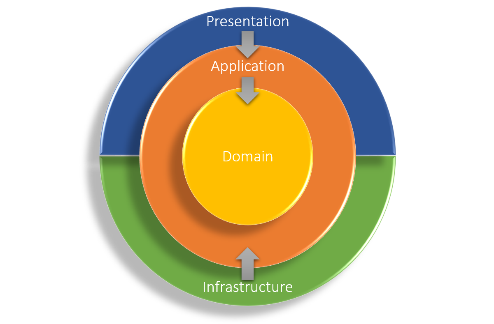
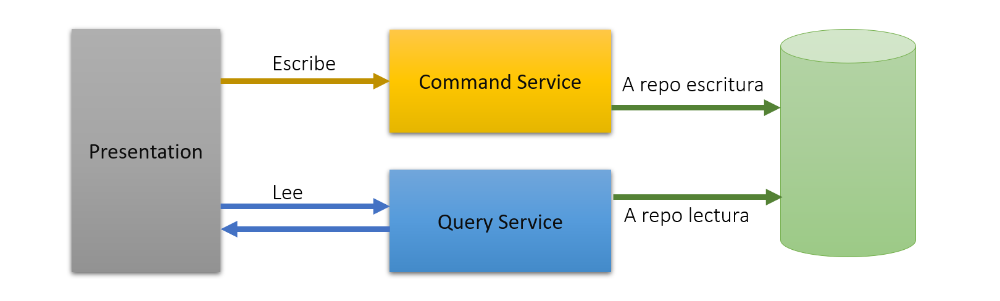
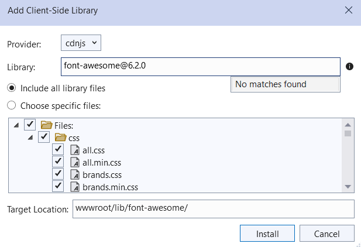
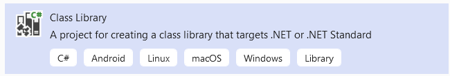
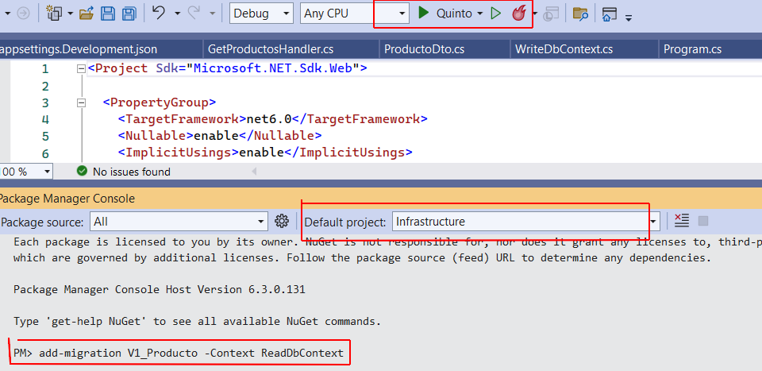

# Dependencia en Arquitectura Limpia y CQRS

## Objetivo del ejercicio

Con este ejercicio lo que se quiere lograr es un proyecto en el cual 
se vea cómo se debe organizar nuestra aplicación para que esté alineada
con la arquitectura limpia y cómo se implementa el patrón de diseño 
CQRS.

Para este ejercicio haremos un ABM tal cual como hicimos en el anterior
proyecto solamente que esta vez lo implementaremos con algunos nuevos
patrones que estaremos viendo. 
* Arquitectura limpia
* CQRS

El modelo que utilizaremos es el de Producto.

## Arquitectura Limpia

El viaje del desarrollo de aplicaciones ha sido uno de prueba y error constante.
Luego del establecimiento claro de SOLID, de los patrones de diseño y de la
programación defensiva y el testeo extensivo; y luego de que la infraestructura
nos haya dado una mano con el advenimiento de los DevOps y los contenedores con
Docker y Kubernetes.

Está claro que utilizar una arquitectura no acorde con arquitectura limpia o 
microservicios no permite realizar todas estas tareas de manera automatizada,
replicable, escalable y no se puede sacar provecho de las bondades de la 
infraestructura.

Este modelo trata de que todo lo que utilicemos sea independiente y se pueda 
testear de manera separada. Por eso es que es importante respetar la dependencia
de los elementos de esta arquitectura. Los elementos son:

* **Domain**: El dominio del modelo. Aquí están todas las clases que representan
a entidades que tienen que ver con la lógica de negocios de nuestra aplicación.
* **Application**: Aquí se encuentran los casos de uso programados
* **Infrastructure**: En este proyecto se colocan las implementaciones de los
servicios que se han definido en el dominios.
* **Presentation**: Este es cualquiera de los proyectos que necesita toda la
información y funcionalidad para poder presentarlo de alguna manera. 

La relación entre cada uno de ellos se puede ver en el siguiente diagrama

Las flechas indican la dependencia entre cada uno de estos elementos. Como
se puede observar el dominio no depende de ningún elemento. Cuando debemos
testear alguna de las capas intermedias como la aplicación, entonces se
hacen Mocks de las partes que tienen que ver con los otros elementos.

## CQRS

El significado de la sigla es Command and Query Responsibility Seggregation.
Traducido viene a ser la separación de responsabilidades entre lo que es un
comando y lo que es una consulta. 



Un comando es cualquier operación que resultará en un cambio en los datos
de la base de datos. Y una consulta es simplemente una lectura. El objetivo de 
implementar este patrón de diseño es simplemente poder realizar presentaciones 
de la información sin preocuparse si la parte transaccional está saturada.

## Factories o fábricas de objetos

Una fábrica de objeto es simplemente una clase donde colocamos el uso del 
constructor de los objetos que queremos fabricar. Esto permite separar la 
complejidad de construir un objeto del objeto en sí.

## DTO Data Transfer Objects

Los objetos de transferencia son objetos que son copia fiel del dominio
pero no deben ser tomados en cuenta como dominio porque no tienen toda
la lógica de negocios que los hace pesados.

Es importante notar algunas diferencias con los objetos de dominio:
* Los objetos de dominio no tienen referencias entre ellos, así no bloquean
otros objetos cuando estos se actualizan.
* Los objetos de transferencia tienen referencias entre ellos para que 
las consultas que se hagan puedan traer los objetos enlazados.

## Preparar el proyecto Web

1. Hacer un proyecto Web (Model-View-Controller) que se llame Quinto. Ya conocemos
la plantilla que se debe utilizar. Esta plantilla automáticamente trae la librería
de bootstrap así que no hay que hacer nada. Pueden ver que la trae ya que el 
Layout debe tener las línea:
```
<link rel="stylesheet" href="~/lib/bootstrap/dist/css/bootstrap.min.css" />
...
<script src="~/lib/bootstrap/dist/js/bootstrap.bundle.min.js"></script>
```

2. Colocar la libreria de font-awesome como se hizo en el anterior proyecto



Asegurarse que en el layout, en la parte de head, se encuentra:
```
<link rel="stylesheet" href="~/lib/font-awesome/css/all.css" />
```

## El modelo de Producto para nuestra aplicación

Para una aplicación de verdad, en general haremos varios proyectos dentro 
de la solución. En el patrón de arquitectura limpia ya nos dice cuales son
los proyectos que deberíamos tener.

3. Añadir un nuevo proyecto a nuestra solución. El proyecto usa la plantilla 
de librería de clases. Le pondremos de nombre **Domain**. 
Para esto utilizar la plantilla de proyecto Class Library como se ve en la figura.



4. Colocar la carpeta Models con los modelos que debemos tener. En este caso
es la clase Producto.

5. Crear un Factory para la clase Producto. Esto se hace creando la interfaz
de IProductoFactory con su implementación correspondiente ProductoFactory
en la carpeta Factories del dominio.

## Preparar el contexto de escritura para CQRS

6. Crear un proyecto librería para Infrastructure. En este proyecto se colocan
todas las implementaciones y también se colocan los contextos de base de datos
para crear la separación que requiere CQRS.

7. Crear el contexto para escritura WriteDbContext en la carpeta Contexts.
Para esto se necesitará el nuget EntityFrameworkCore porque la clase debe ser
subclase de DbContext. El código debe contener lo siguiente:
* La clase debe ser subclase de DbContext
* Se debe colocar una propiedad llamada Productos para nuestra tabla.
* El constructor toma como argumento las opciones y se pasa a la superclase 
* Usar la configuración de la entidad para que se pueda utilizar la tabla.
```
public class WriteDbContext : DbContext
{
	public virtual DbSet<Producto> Productos { get; set; }

	public WriteDbContext(DbContextOptions<WriteDbContext> options) 
		: base(options) { }

	protected override void OnModelCreating(ModelBuilder modelBuilder)
	{
		base.OnModelCreating(modelBuilder);

		var productoConfig = new ProductoWriteEntityConfiguration();
		modelBuilder.ApplyConfiguration<Producto>(productoConfig);
	}
}
```
8. Crear el entity configuration de la tabla Producto. Para lograr realizar 
este código sin problemas se tiene que incorporar con nuget el paquete
EntityFrameworkCore.SqlServer. Así funcionan los métodos ToTable.
```
public class ProductoWriteEntityConfiguration : IEntityTypeConfiguration<Producto>
{
	public void Configure(EntityTypeBuilder<Producto> builder)
	{
		builder.ToTable("Productos");
        builder.HasKey(x => x.Id);
	}
}
```

## Repositorio para el modelo Producto

9. Crear una interfaz para todos los repositorios. Esto es para todos los 
repositorios que se utilizan en las operaciones de escritura.

10. Crear la interfaz para el repositorio de Producto. Todavía no se crea la 
implementación en este lugar.

11. Crear la implementación del repositorio. Esto se debe crear dentro de la
carpeta Repositories del proyecto Infrastructure. Adicionalmente se verá que
se debe adicionar la referencia al proyecto Domain. Como vemos, esta 
dependencia respeta el diagrama que teníamos de arquitectura limpia.

El DbContext que se utiliza es el de escritura.
```
public class ProductoRepository : IProductoRepository {
	private readonly DbSet<Producto> productos;

	public ProductoRepository(WriteDbContext dbContext)	{
		this.productos = dbContext.Productos;
	}

	public async Task CreateAsync(Producto o) {
		await productos.AddAsync(o);
	}

	public async Task DeleteAsync(Producto p) {
		productos.Remove(p);
		await Task.CompletedTask;
	}

	public async Task<Producto> FindByIdAsync(Guid id) {
		return await productos.SingleAsync(x => x.Id.Equals(id));
	}

	public async Task UpdateAsync(Producto p) {
		productos.Update(p);
		await Task.CompletedTask;
	}
}
```

## Caso de uso para el producto

En este momento se debe implementar el mediator que habíamos visto
en el anterior proyecto. Este mediator se encuentra en un proyecto
aparte que llamaremos Application. Al igual que el resto, la plantilla
que se usa es la de librería de clase.

En esta librería se programan los comandos y las consultas del mediator
como casos de uso de nuestra aplicación.

12. Crear el proyecto Application como libreria de clases. 

13. Cargar el paquete nuget Mediatr para que se pueda utilizar el 
patrón mediator. Se puede también cargar el Mediatr con inyección de
dependencia ya que también lo necesitaremos y por dependencia traerá
el Mediatr.

14. Crear el comando para crear un producto en una carpeta UseCases. 
```
public class CreateProductoCommand : IRequest<Guid>
{
	public string Nombre { get; set; }
	public decimal Precio { get; set; }
	public int Stock { get; set; }

	public CreateProductoCommand(string nombre, decimal precio, int stock)
	{
		Nombre = nombre;
		Precio = precio;
		Stock = stock;
	}
}
```
15. Crear el controlador de este comando dentro de la misma carpeta 
UseCases
```
public class CreateProductoHandler : IRequestHandler<CreateProductoCommand, Guid>
{
	private readonly IProductoFactory _productoFactory;
	private readonly IProductoRepository _productoRepository;
	public CreateProductoHandler(IProductoFactory productoFactory, 
		IProductoRepository productoRepository)
	{
		_productoFactory = productoFactory;
		_productoRepository = productoRepository;
	}

	public async Task<Guid> Handle(CreateProductoCommand request, 
		CancellationToken cancellationToken)
	{
		Producto p = _productoFactory.Create(
			Guid.NewGuid(), request.Nombre, request.Precio, request.Stock);
		await _productoRepository.CreateAsync(p);
		return p.Id;
	}
}
```
16. Crear el comando para eliminar un Producto de la misma manera que se
creo el comando anterior.

17. Crear el controlador del comando para eliminar un Producto.

## Implementación de la lectura de Productos

18. En el proyecto Application crear el objeto de transferencia
ProductoDto. 

```
public class ProductoDto
{
	public Guid Id { get; set; }
	public string Nombre { get; set; }
	public decimal Precio { get; set; }
	public int Stock { get; set; }

	public ProductoDto(Guid id, string nombre, decimal precio, int stock)
	{
		Id = id;
		Nombre = nombre;
		Precio = precio;
		Stock = stock;
	}
}
```

19. En el proyecto de Application crear la consulta para obtener
la lista de Productos. Esta consulta no necesita argumentos ya que 
traerá todos los Productos. El tipo de respuesta es una lista de ProductoDto.

20. Crear el DbContext de lectura para toda la aplicación. Esto se crea
en el mismo lugar que el de escritura.
```
public class ReadDbContext : DbContext
{
	public virtual DbSet<ProductoDto> Productos { get; set; }

	public ReadDbContext(DbContextOptions<ReadDbContext> options) : base(options){}

	protected override void OnModelCreating(ModelBuilder builder)
	{
		base.OnModelCreating(builder);
		var productoConfig = new ProductoReadEntityConfiguration();
		builder.ApplyConfiguration<ProductoDto>(productoConfig);
	}
}
```

21. Crear el entity configuration para ProductoDto. Este tiene detalles de cómo
debe estar implementada la tabla en la base de datos. Este es el contexto que 
usaremos para el migration, por eso es que definimos esto acá.
```
public class ProductoReadEntityConfiguration : IEntityTypeConfiguration<ProductoDto>
{
	public void Configure(EntityTypeBuilder<ProductoDto> builder)
	{
		builder.ToTable("Productos");
		builder.HasKey(x => x.Id);

		builder.Property(x => x.Nombre)
			.HasMaxLength(250);

		builder.Property(x => x.Precio)
			.HasColumnType("decimal(18,4)");

		builder.Property(x => x.Stock)
			.HasColumnType("int");
	}
}
```

22. Crear el controlador en el proyecto Infrastructure. Esto en una 
carpeta de UseCases. Esto para que los controladores de lectura estén 
incluso en otro proyecto que los controladores de escritura.

Para esto el proyecto Infrastructure necesitará referencia al proyecto
Application.

**Nota**.- No es necesario crear un repository para la lectura. Esta se
construye directamente dentro del handler como se puede ver en el código que se 
muestra en este paso.


## Inyección de dependencias entre proyectos

En cada uno de los proyectos existen interfaces que tienen sus respectivas 
implementaciones en el mismo proyecto o incluso en otros proyectos. Como la 
dependencia está muy clara en el diagrama de arquitectura limpia lo más
fácil será seguir la linea de dependencias e ir armando todos los servicios
que necesitan ser enlazados en el lugar donde se tenga la implementación.


23. En el Program del proyecto de Presentación se debe colocar un llamado
a la inicialización de la inyección de dependencias para toda la solución.
```
builder.Services.AddInfrastructure(builder.Configuration);
```

24. Crear la clase Extensions en la carpeta Injections que realiza las 
operaciones de inyección de dependencias. Cargar el paquete nuget de Inyección 
de dependencia de Mediatr para que funcione.

```
public static class Extensions
{
	public static IServiceCollection AddInfrastructure(this IServiceCollection services,
		IConfiguration configuration)
	{
		services.AddApplication();
		services.AddMediatR(Assembly.GetExecutingAssembly());

		var connectionString =
			configuration.GetConnectionString("DBConnectionString");

		services.AddDbContext<WriteDbContext>(context =>
			context.UseSqlServer(connectionString));

		services.AddScoped<IProductoRepository, ProductoRepository>();

		return services;
	}
}
```
Aquí es donde se indica el nombre del string de conexión que se buscará en el 
appsettings de la aplicación.

25. En esta clase hay un llamado a AddApplication. Esto significa que en el
proyecto Application también debemos crear la clase Extensions.

```
public static class Extensions
{
	public static IServiceCollection AddApplication(this IServiceCollection services,
		IConfiguration configuration)
	{
		services.AddMediatR(Assembly.GetExecutingAssembly());
		services.AddTransient<IProductoFactory, ProductoFactory>();

		return services;
	}
}
```
La razón por la que se usa Transient es porque queremos que el objeto factory se
cree en todo lugar donde se lo utiliza.

## Migration

Ahora estamos listos para crear el migration que nos permita crear y colocar la
tabla en la base de datos.

26. Asegurarse de que el DbContext para Read puede ser creado, esto se hace en 
el Extensions de Infrastructure
```
services.AddDbContext<ReadDbContext>(context => context.UseSqlServer(connectionString));
```

27. Cargar el nuget de EntityFrameworkCore Tools para que podamos usar la consola.


28. Crear la migración desde la consola apuntando al proyecto de Infrastructure y 
colocando el contexto para hacer la migración como el contexto Read.



Asegurarse que en el proyecto de Presentación también se tiene cargado el nuget
EntityFrameworkCore.Design. La línea a ejecutar es:

```
add-migration v1_Producto -Context ReadDbContext
```

29. Se ejecuta el migrations para tener la base de datos con la tabla correspondiente.
No olvidarse de incluir el contexto.
```
update-database -Context ReadDbContext
```

## Obtener datos a través de nuestro contexto Read

30. Preparar la respuesta como forma de ViewModel sobre el objeto de tipo
ProductoDto. Este ViewModel se debe crear en el proyecto Application para que
se cumpla la dependencia de arquitectura limpia. 

31. Completar el controlador de la consulta. Esta vez solamentecritura
se utiliza el DbContext.
```
public async Task<List<ProductoDtoViewModel>> Handle(
    GetProductosQuery request, CancellationToken cancellationToken)
{
	List<ProductoDtoViewModel> modelo = new List<ProductoDtoViewModel>();

	List<ProductoDto> productos = await Task.Run(() => {
		return _readDb.Productos.ToList();
	});

	foreach(ProductoDto producto in productos)
	{
		modelo.Add(_mapper.Map<ProductoDtoViewModel>(producto));
	}

	return modelo;
}
```

32. Ahora se puede crear el controlador que usa directamente el mediator.
```
[HttpGet]
public async Task<IActionResult> Index()
{
	List<ProductoDtoViewModel> modelo = 
		await _mediator.Send(new GetProductosQuery());
	return View(modelo);
}
```

## Completar el controlador para las operaciones de escritura

33. Crear el método para insertar un objeto en la base de datos. Aquí
se debe usar el ViewModel para convertirlo al objeto de tipo Comando.

```
[HttpPost]
public async Task<IActionResult> Insert(ProductoDtoViewModel modelo)
{
    CreateProductoCommand cmd = 
        new CreateProductoCommand(modelo.Nombre, modelo.Precio, 0);
    await _mediator.Send(cmd);

    return RedirectToAction(nameof(Index));
}
```

34. Crear el método para eliminar un objeto de la base de datos.
```
[HttpGet]
public async Task<IActionResult> Eliminar(Guid modalEliminarId)
{
	bool res = await _mediator.Send(new RemoveProductoCommand(modalEliminarId));
	if (!res) {  ...   }

	return RedirectToAction(nameof(Index));
}
```

## Crear las vistas para enganchar con los controladores

35. Del anterior proyecto copiar la vista de Index. Debería funcionar 
exactamente igual, el único cambio es el modelo que se usa.

36. Eliminar la columna de edición del objeto ya que no utilizaremos
en este proyecto.

37. Del anterior proyecto copiar la vista de Insert. Cambiar los 
campos para que sean los mismos que nuestro ViewModel y cambiar el modelo.
