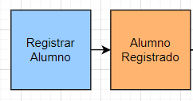
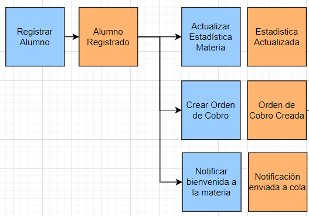
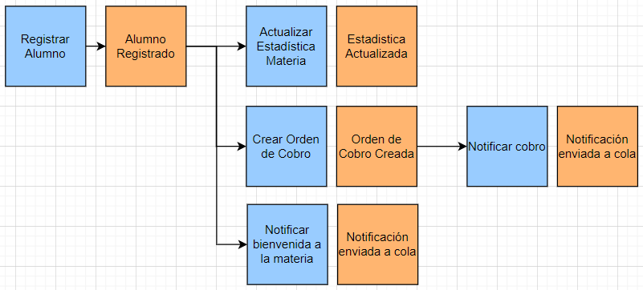
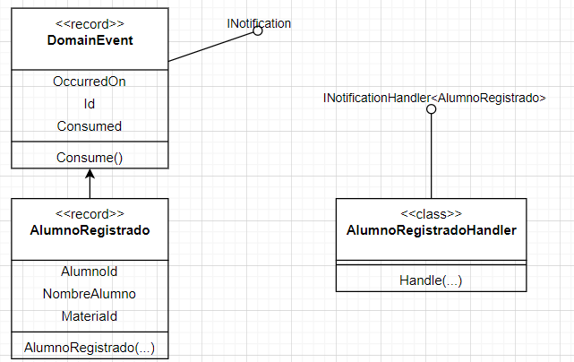
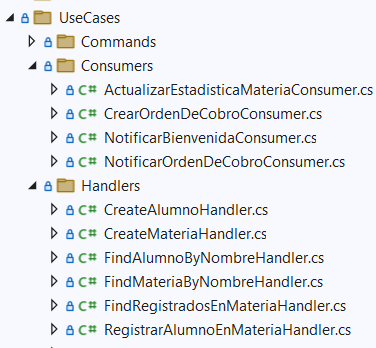

# Mediator y Agregado

## Objetivo del ejercicio

El objetivo de este ejercicio es el de poder simplificar 
códigos que suelen llegar a ser muy complicados. En el pasado me 
ha tocado tener programas que tienen muchísimas líneas de código
y luego de un tiempo se vuelven intocables.

## Problema a resolver

Para el siguiente problema intervienen 5 estructuras.

1. Alumnos: Estos son alumnos que se deben registrar en materias 
y pagar por ese registro.
2. Materias: Son los cursos que tienen un cupo y que pueden aceptar
alumnos.
3. Registrados: Es la lista que mantiene la relación entre materias
y alumnos para saber quienes están inscritos en una materia.
4. OrdenDeCobro: Son registros de cuánto es lo que debe pagar un
alumno al registrarse en una materia.
5. Notificaciones: Es el registro de los mensajes que se deben 
enviar a los alumnos para notificarles de lo que ocurre con sus materias.

En este ejercicio lo que haremos es resolver un problema que es
registrar a un alumno en una materia. El problema es que esto no es
tan sencillo como registrar una linea en Registrados, tiene una serie
de pasos que se ven a continuación.

* Registrar a un alumno en la materia
* Actualizar las estadísticas de la materia
* Enviar un mensaje de bienvenida al alumno
* Crear una orden de cobro por el registro
* Enviar un mensaje con las instrucciones para el pago

## Solución normal

El código que tendríamos normalmente sería el siguiente:

```
Alumno alumno = await _alumnoRepository.FindById(request.AlumnoId);
Materia materia = await _materiaRepository.FindById(request.MateriaId);
materia.Registrados = 
await _mediator.Send(new FindRegistradosEnMateriaQuery(request.MateriaId));

materia.RegistrarAlumno(alumno);
await _materiaRepository.RegistrarAlumnoAsync(materia.Id, alumno.Id);
_logger.LogDebug("La materia actualiza nro registrados en base de datos por EF");

// Mensaje de Bienvenida
//-----------------------------
string mensaje = Constants.MENSAJE_BIENVENIDA;
mensaje = mensaje.Replace("{NOMBRE}", alumno.Nombre);
string email = alumno.Nombre + "@" + Constants.DOMINIO;

Notificacion notificacion =
	_notificacionFactory.CrearNueva(Guid.NewGuid(), mensaje, email);
await _notificacionRepository.CreateAsync(notificacion);

// Orden de Cobro
//--------------------------------
OrdenDeCobro orden = _ordenDeCobroFactory.CrearOrdenDeCobro(
		Guid.NewGuid(),
		alumno.Id,
		materia.Id,
		Constants.COSTO);
await _ordenDeCobroRepository.CreateAsync(orden);

mensaje = Constants.MENSAJE_COBRO;
mensaje = mensaje.Replace("{MONTO}", orden.Monto.ToString("0.00"));
mensaje = mensaje.Replace("{NOMBRE}", alumno.Nombre);

notificacion =
	_notificacionFactory.CrearNueva(Guid.NewGuid(), mensaje, email);
await _notificacionRepository.CreateAsync(notificacion);

await _unitOfWork.Commit();
```

Este código refleja en cierta manera la complejidad de una lógica de negocios
típica en programas de gestión de la información que deben integrar algunos
flujos específicos. Si colocamos mensajes de Log, al ejecutar obtenemos lo
siguiente:

* Obtiene alumno y materia para poder trabajar estrictamente en dominio
* Registra alumno en materia (en dominio solamente)
* Guarda el registro del alumno en esa materia en la base de datos
* La materia actualiza nro registrados en base de datos por EF
* Notificacion creada: 4be2efd2-d560-4016-bd92-781d82a8754f
* Grabar la notificación en la base de datos
* Se crea la orden de cobro a Hugo
* Se guarda la orden de cobro en la base de datos
* Notificacion creada: 7a2d175a-ae60-41ea-83ec-587445b46691
* Guardar en base de datos
* Se hace el commit de todos los cambios

Los identificadores que aparecen son fruto de una ejecución específica.

## Event Storming

Se trata de partir toda la ejecución en eventos manejados por dominios
específicos. Vamos a pensar que tenemos los siguientes dominios:

* El dominio de los alumnos y los registros de estos.
* El dominio de las materias (que en realidad podría ser parte del anterior)
* El dominio de las notas de cobro.
* El dominio de las notificaciones.

En el mismo flujo que tenemos vamos sacando lo que corresponde a cada 
dominio por medio de eventos que vamos a comunicar entre uno y otro.

Al lado de los eventos viven los comandos, es decir, la intención de hacer
algo específico. Para el caso, nuestro comando sería RegistrarAlumno.



Como se puede ver el comando está en color azul y el verbo está en la forma
de dar un comando u orden. De la misma manera, el resultado de que el comando
se halla realizado es el lanzamiento de un evento que está con el mismo 
verbo solo que en la forma de tiempo pasado. Esta convención de nombres
es muy importante para que se pueda reconocer fácilmente la labor de 
cada uno de estos objetos que vamos a crear.

La magia comienza cuando, a raíz del evento que lanzamos AlumnoRegistrado,
tenemos tres acciones independientes:

1. Actualizar la estadística de la materia
2. Crear la Orden de Cobro
3. Enviar un mensaje de bienvenida a la materia

Cada una de estas acciones está en forma de comando; y el resultado de las
mismas da lugar a un evento en particular.



Finalmente, cuando se crea la orden de cobro se lanza el evento de 
Orden de Cobro Creada. Ese evento da lugar a la notificación de la 
orden de cobro. Y así tenemos una idea completa de los eventos para nuestro
ejemplo.



## Concatenación de eventos

Para poder comunicar entre los diferentes métodos que debemos ejecutar la 
comunicación la haremos a través de eventos a manera del patrón observer.

Cada evento que lanzamos es una instancia de DomainEvent que a su vez es
una implementación de la interfaz de INotification que es básicamente una
interfaz de marca solamente.

Adicionalmente, DomainEvent es un record, con lo cual las subclases garantizan
que una vez que los atributos toman un valor, éste no cambia.

Esta es la parte de los eventos, nos falta definir la parte de quien agarra
los eventos. El mediator nos da una solución. En vez de enviar un objeto de 
tipo IRequest y esperar una respuesta de un IRequestHandler el mediator
nos permite:

* **Notificar** un evento al universo, y ....
* Quien sea que esté definido para manejar ese evento será llamado (**Handler**)



Toda la parte del mediator ahora la vamos a poner en una carpeta llamada 
UseCases para reflejar un poco mejor lo que realmente hace.



Ahora estamos listos para poder implementar la solución de nuestro problema 
con eventos y usando el patrón de Agregado Raíz.

### Una nota importante sobre el Unit of Work

En nuestro ejemplo inicial, nuestra transacción inicia al principio del handler
y termina con el commit final. Ese commit final nos asegura que todas las 
transacciones intermedias se realizan como una sola.

Pero ahora hemos separado nuestra lógica en varios pedazos. Cómo podemos garantizar
una ejecución en forma de transacción. La respuesta:

Gracias a la inyección de dependencias y cómo se ha definido la misma para la 
conexión con la base de datos.

Esto significa lo siguiente:

> En un solo proceso, sin importar las veces que se inyecte el DbContext, la instancia
> es la misma, por lo tanto, se mantiene en la misma transacción

Nuestro gran problema ahora es que puede ser que los pedazos más
pequeños de código también hagan uso del commit y solamente queremos que
se haga una sola vez al final de la ejecución. Para esto usaremos una 
variable entera `_transactionCounter` que permite que solamente se ejecute 
commit cuando el valor es 1.

Cada entidad que es obtenida con el `FindById` del repositorio; está siendo
observada por el Entity Framework. Por herencia tienen la lista de eventos que 
lanzan. Entonces, nuestro Unit of Work lo que hace es preguntar por aquellas
entidades que están siendo observadas y selecciona los eventos asociados.

Los consume y hace `Publish`; esto significa que notifica y se ejecuta el 
handler de todos los códigos que han sido definidos como handlers de esos 
eventos.

El código completo de la parte `Commit` del Unit of Work sería así:

```
public async Task Commit()
{
	_transactionCounter++;
	
	var domainEvents = _context.ChangeTracker.Entries<Entity<Guid>>()
		.Select(x => x.Entity.DomainEvents)
		.SelectMany(x => x)
		.Where(x => !x.Consumed)
		.ToArray();

	foreach (DomainEvent domainEvent in domainEvents)
	{
		domainEvent.Consume();
		await _mediator.Publish(domainEvent);
	}

	if (_transactionCounter == 1)
	{
		await this._context.SaveChangesAsync();
	} 
	else
	{
		_transactionCounter--;
	}
}
```

## Preparando nuestros casos de uso en mediator

El primer caso de uso que tenemos es el primer comando que nos toca ejecutar
que es el de registrar un alumno en una materia.

```
public async Task<bool> Handle(RegistrarAlumnoEnMateriaCommand request, 
		CancellationToken cancellationToken)
{
	Alumno alumno = await _alumnoRepository.FindById(request.AlumnoId);
	Materia materia = await _materiaRepository.FindById(request.MateriaId);
	materia.Registrados = await _mediator.Send(new FindRegistradosEnMateriaQuery(request.MateriaId));
	
	materia.RegistrarAlumno(alumno);

	materia.ConsolidarRegistrado(alumno.Id, alumno.Nombre);

	await _materiaRepository.RegistrarAlumnoAsync(materia.Id, alumno.Id);
	await _unitOfWork.Commit();
	return true;
}
```
La gran diferencia con la forma del método anterior es la llamada a `ConsolidarRegistrado`. 
Esta llamada coloca nada más el evento correspondiente en el objeto:

```
public void ConsolidarRegistrado(Guid alumnoId, string nombre)
{
	string email = nombre + "@universidad.com";
	AddDomainEvent(new AlumnoRegistradoEvent(alumnoId, this.Id, nombre, email));
}
```
Esto tiene varias ventajas:

* Solamente nos dedicamos al tema de grabar el registro del alumno en la materia
* La complejidad del método baja sustancialmente
* El testeo de solamente esta parte es menos complejo
* La forma del método sigue una mejor práctica
* La lógica de negocios se mantiene en los métodos del dominio

Una de las ventajas que se indica es la forma del método que se repite en todos 
los handlers:

1. **Preparación** Se obtienen todos los datos que se necesitan para trabajar
con los objetos del dominio
2. **Lógica** Se ejecuta la lógica (de preferencia única) que este método debe
realizar en los objetos del dominio.
3. **Evento** Se lanza el evento para que luego se notifique.
4. **Interfaz** Se usan las interfaces de los servicios, en este caso se usan los
repositorios para grabar la información.
5. **Confirmar** Se llama al commit del servicio de la base de datos.

## Implementación de los consumidores de eventos

Del gráfico que sale del Event storming podemos ver que en realidad las otras partes
del código son nada más código que está reaccionando a algún evento en particular.
Como estos consumidores de eventos son también handlers entonces la misma regla se 
aplica en la forma en que el código se implementa en los mismos.

Veamos un ejemplo en la creación de la orden de cobro `CrearOrdenDeCobroConsumer`

```
public async Task Handle(AlumnoRegistradoEvent notification, CancellationToken cancellationToken)
{
	OrdenDeCobro orden = _ordenDeCobroFactory.CrearOrdenDeCobro(
			Guid.NewGuid(), 
			notification.AlumnoId, 
			notification.MateriaId, 
			Constants.COSTO);
	orden.ConsolidarCreada();
	await _ordenDeCobroRepository.CreateAsync(orden);
	await _unitOfWork.Commit();
}
```

Nuevamente vemos como la complejidad del código ha sido reducida sustancialmente
y podemos claramente ver que se repiten las ventajas enumeradas anteriormente.

## Ejecución del programa 

El programa de este ejemplo es una aplicación de consola. Para poder ejecutarlo no 
olvide los siguientes pasos:

1. Modificar el `appsettings` para que apunte a la base de datos correcta
2. Hacer el update-database en la consola de adminitración de paquetes de VS
3. Ejecutar la aplicación.

Para efectos didácticos se han incluido una serie de logs en las partes claves
del código para que podamos hacer seguimiento preciso de lo que está pasando.
El resultado de la ejecución se puede ver en el siguiente detalle:

1. [REGISTRAR ALUMNO] Obtiene alumno y materia para poder trabajar estrictamente en dominio
2. [REGISTRAR ALUMNO] Registra alumno en materia (en dominio solamente)
3. [REGISTRAR ALUMNO] Publica el evento y lo pone en la cola
4. [REGISTRAR ALUMNO] Guarda el registro del alumno en esa materia en la base de datos
   * [UNIT OF WORK] Se notifica el evento MediatorAndAggregate.Events.AlumnoRegistradoEvent
      * [CONSUMER: ACTUALIZAR ESTADISTICA] Se actualiza la estadistica de la materia 7e07532a-7af6-4c8c-af83-3a164751bb0b con 1 registrados
      * [CONSUMER: ACTUALIZAR ESTADISTICA] Se lanza el evento de Estadistica Actualizada
      * [CONSUMER: ACTUALIZAR ESTADISTICA] El cambio en el objeto hace el update automáticamente
         * [UNIT OF WORK] Se notifica el evento MediatorAndAggregate.Events.EstadisticaMateriaActualizadaEvent
         * [UNIT OF WORK] Aquí no hay commit porque TXN counter es 2
11. [CONSUMER: ACTUALIZAR ESTADISTICA] COMMIT
12. [Crear Orden de Cobro] Se crea la orden de cobro a Hugo
13. [Crear Orden de Cobro] Se lanza el evento Orden de Cobro Creada
14. [Crear Orden de Cobro] Se guarda la orden de cobro en la base de datos
15. [UNIT OF WORK] Se notifica el evento MediatorAndAggregate.Events.OrdenDeCobroCreadaEvent
16. [Notificar Orden de Cobro] Notificacion creada: a11d2853-cc24-4a3d-ac1c-f15fbdff63d2
17. [Notificar Orden de Cobro] Comunicar evento Notificacion Creada
18. [Notificar Orden de Cobro] Guardar en base de datos
19. [UNIT OF WORK] Se notifica el evento MediatorAndAggregate.Events.NotificacionCreadaEvent
20. [UNIT OF WORK] Aquí no hay commit porque TXN counter es 3
21. [Notificar Orden de Cobro] COMMIT
22. [UNIT OF WORK] Aquí no hay commit porque TXN counter es 2
23. [Crear Orden de Cobro] COMMIT
24. [Notificar Bienvenida] Notificacion creada: bd9d536c-83ea-4e5f-9ace-576a5450344b
25. [Notificar Bienvenida] Comunicar evento Notificacion Creada
26. [Notificar Bienvenida] Grabar la notificación en la base de datos
27. [UNIT OF WORK] Se notifica el evento MediatorAndAggregate.Events.NotificacionCreadaEvent
28. [UNIT OF WORK] Aquí no hay commit porque TXN counter es 2
29. [Notificar Bienvenida] COMMIT
30. [UNIT OF WORK] Se hace el commit de todos los cambios