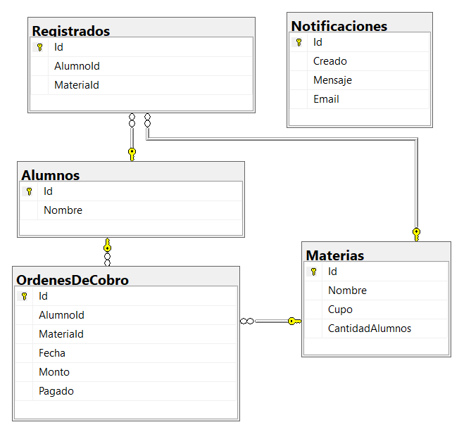

# Arquitectura Limpia, Mediator, CQRS y Agregado

En este proyecto se trata de replicar lo mismo que teniamos en el 
anterior ejercicio pero ya dentro del marco de un proyecto completo
de Arquitectura limpia con todos los proyectos separados y aplicando
los patrones de diseño que se ha visto en todos los proyectos
anteriores.

Veremos a continuación cada uno de los pasos necesarios para poder
replicar el proyecto.

## Crear proyectos

1. Lo primero es crear el proyecto web con la plantilla de proyecto
Aplicación ASP.NET Core Web API. Esto nos permitirá tener una API así
como una página web.

2. Crear el proyecto de librería de clases para Domain.

3. Crear el proyecto de librería de clases para SharedKernel.

4. Crear el proyecto de librería de clases para Infrastructure.

5. Crear el proyecto de librería de clases para Application.

## Proyecto SharedKernel 
En este proyecto básicamente se coloca todo lo necesario para poder
realizar el patrón Raiz Agregado tal cual como lo vimos en el anterior
proyecto. Posteriormente, en este proyecto, se puede colocar las cosas
en comun para poder hacer las:

* Validaciones de los objetos del dominio
* Los Objetos Valor (Value Objects) de los objetos del dominio

1. Crear las clases AggregateRoot, DomainEvent y Entity. Estos son los 
mismos del anterior proyecto, solamente se cambio el espacio de nombres
de las clases para que sea igual que el proyecto.

## Proyecto Domain
Básicamente en este proyecto replicaremos todo lo del funcionamiento y
logica de negocios del anterior proyecto.

Todo lo realizado en este proyecto es para tener toda la funcionalidad de
alta, baja y modificación de la aplicación. No se programa nada que se 
utilice para leer datos. Toda la lectura se realizará en otro lugar con 
otras clases.

1. Creamos las excepciones replicando el proyecto anterior en una carpeta
Exceptions.

2. Creamos los eventos replicando el proyecto anterior en una carpeta Events.

3. Crear los modelos replicando el proyecto anterior en una carpeta Models.

4. Crear las factorias replicando el proyecto anterior en una carpeta Factories.

5. Crear el archivo con las constantes que se usan en el dominio.

6. Crear la extensión para definir las dependencias del proyecto. Basicamente
para inyectar las factorías de los objetos del dominio.

7. Colocar en el proyecto web la dependencia 

```c#
builder.Services.AddDomainDependencies();
```

8. Copiar las interfases que se crearon en el anterior proyecto para los repositorios. 
Acomodar los espacios de nombre.

## Proyecto Infrastructure
En este proyecto comenzamos a aplicar algunos de los patrones que forman la parte 
esencial de la arquitectura limpia. Probablemente el más importante es el de CQRS.

En el proyecto 5 se vio la implementación de CQRS con dos DbContext. Hacemos lo
mismo ahora en el proyecto de Infrastructure.

### Migrations

Los migrations se hacen con el DbContext de lectura así que tenemos que tener todo 
bien definido en ese contexto. El contexto de escritura solamente tiene referencia
a la estructura del objeto simple.

Esto hace que al escribir los datos de un objeto, no se bloquean más registros que los
absolutamente necesarios. Es decir, solamente la tupla en cuestión.

## Contextos DB

1. Creamos la clase WriteDbContext en la carpeta Contexts del proyecto.

2. El metodo OnModelCreating tiene la referencia a los EntityTypeConfigurations de la
carpeta Write de Configurations en el mismo proyecto.
```c#
var alumnoConfig = new AlumnoWriteEntityConfiguration();
modelBuilder.ApplyConfiguration<Alumno>(alumnoConfig);
```

3. En los configurations se debe colocar que se va a ignorar los atributos de DomainEvents
para que estos no aparezcan en la base de datos.
```c#
builder.Ignore(x => x.DomainEvents);
```

4. Creamos la clase ReadDbContext en la carpeta Contexts del proyecto

5. Creamos las configuraciones en la carpeta Read copiando de la carpeta Write.

6. Copiamos el mismo codigo de WriteDbContext en ReadDbContext. Solamente debemos cambiar Write
por Read o aumentar ReadModel donde haga falta.
```c#
var alumnoConfig = new AlumnoReadEntityConfiguration();
modelBuilder.ApplyConfiguration<AlumnoReadModel>(alumnoConfig);            
```

Es importante que al momento de probar si es que los DbContext estan funcionando que la aplicación
Web tenga el paquete de Entity Framework Core Design y que la base de datos esté creada.
Para poder crear las tablas como siempre solamente utilizar la consola y ejecutar:
```
add-migration v1 -Context ReadDbContext
update-database -Context ReadDbContext
```

Las tablas deberían quedar de la siguiente manera:


### Repository

Aplicamos el patrón Repository para que podamos utilizar estas consultas para nuestros handlers
que se encarguen de los ABM (CRUD).

7. Solamente copiar la implementación de los repositorios tal cual como se los tenía en el 
anterior proyecto.

8. Copiar la clase de implementación del patrón UnitOfWork.

9. En la inyección de dependencias asegurarse que se está haciendo el enlace a todas las 
interfases. Aquí el ejemplo de cómo queda:
```c#
public static IServiceCollection AddInfrastructure(this IServiceCollection services,
            IConfiguration configuration)
{
	string connectionString =
	configuration.GetConnectionString("DBConnectionString");

	services.AddDbContext<ReadDbContext>(options =>
		options.UseSqlServer(connectionString, b => b.MigrationsAssembly("Infrastructure")));

	services.AddDbContext<WriteDbContext>(context =>
		context.UseSqlServer(connectionString, b => b.MigrationsAssembly("Infrastructure")));

	services.AddScoped<IUnitOfWork, UnitOfWork>();

	services.AddScoped<IAlumnoRepository, AlumnoRepository>();
	services.AddScoped<IMateriaRepository, MateriaRepository>();
	services.AddScoped<INotificacionRepository, NotificacionRepository>();
	services.AddScoped<IOrdenDeCobroRepository, OrdenDeCobroRepository>();

	return services;
}
```

## Proyecto Application

En este proyecto vamos a colocar principalmente los casos de uso y toda la parte para poder
obtener los datos del contexto de lectura. En este proyecto programamos el patrón MVVM. Entonces,
del contexto obtenemos los ReadModel y en el handler convertimos estos ReadModel a ViewModels.

1. Crear los Dtos que son las vistas modelo que son copia fiel del ReadModel. 

2. Crear los profiles que convierten de los ReadModel a los Dto. En estos profile deben ir 1 o 2
mapeos:
   * ReadModel a Dto
   * Model a Dto
   
ReadModel es el que se ha creado en Infrastructure y el Model es el objeto del dominio
que se ha creado en el proyecto Domain.

### Mediator

Ahora podemos comenzar a crear los casos de uso tal cual los teniamos en el anterior proyecto.
Vamos a completar en este proyecto los casos de uso con los de lectura para que podamos ver la
información que se vaya guardando en la base de datos.

3. Copiar todos los archivos correspondientes a los comandos del anterior proyecto y cambiar
los espacios de nombre.

4. En los casos de uso se necesita cambiar el uso de objetos por objetos de tipo ReadModel cuando
la acción es de lectura. Y convertir estos objetos de tipo ReadModel al Dto correspondiente
para ocultar los campos que no necesitamos que la interfaz u otro conozcan
```c#
public class FindRegistradosEnMateriaHandler : 
        IRequestHandler<FindRegistradosEnMateriaQuery, List<RegistradoDto>>
{
	private readonly DbSet<RegistradoReadModel> Registrados;
	private readonly IMapper _mapper;
	public FindRegistradosEnMateriaHandler(ReadDbContext context, IMapper mapper)
	{
		Registrados = context.Registrados;
		_mapper = mapper;
	}
	public async Task<List<RegistradoDto>> Handle(
		FindRegistradosEnMateriaQuery request, CancellationToken cancellationToken)
	{
		List<RegistradoReadModel> registrados = await Registrados.AsNoTracking()
				.Where(x => x.MateriaId == request.MateriaId).ToListAsync();

		List<RegistradoDto> model = new List<RegistradoDto>();
		foreach(RegistradoReadModel obj in registrados)
		{
			model.Add(_mapper.Map<RegistradoDto>(obj));
		}

		return model;
	}
}
```
En este código se puede ver claramente el uso del mapper para poder crear objetos de tipo Dto
que son accesibles desde el mediator. El controlador hará uso de estos handler sin pasar por 
objetos de tipo ReadModel; esto para evitar que el controlador tenga acceso a atributos que no 
necesita.

Aquí tenemos otro ejemplo:
```c#
public class FindAlumnoByNombreHandler : 
        IRequestHandler<FindAlumnoByNombreQuery, List<AlumnoDto>>
{
	private readonly DbSet<AlumnoReadModel> Alumnos;
	private readonly IMapper _mapper;
	public FindAlumnoByNombreHandler(ReadDbContext context, IMapper mapper)
	{
		Alumnos = context.Alumnos;
		_mapper = mapper;
	}
	public async Task<List<AlumnoDto>> Handle(
		FindAlumnoByNombreQuery request, CancellationToken cancellationToken)
	{
		List<AlumnoReadModel> alumnos =
			await Alumnos.AsNoTracking()
				.Where(x => x.Nombre.Contains(request.Nombre))
				.Take(request.Cantidad)
				.ToListAsync();

		List<AlumnoDto> resultado = new List<AlumnoDto>();

		foreach(AlumnoReadModel alumno in alumnos)
		{
			resultado.Add(_mapper.Map<AlumnoDto>(alumno));
		}
		
		return resultado;
	}
}
```
6. En la inyección de dependencias no olvidarse de añadir la referencia a AutoMapper para que
pueda leer todas las clases que extienden Profile.

7. 

## Proyecto Web

El proyecto web se debe crear como siempre lo hacemos con la plantilla correspondiente.

1. Crear un proyecto web ASP.NET Core Web API


