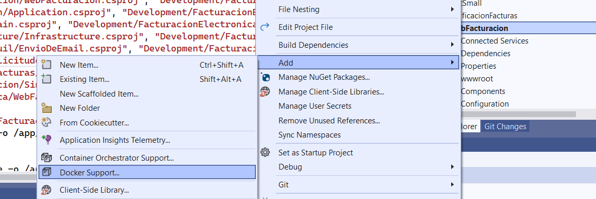
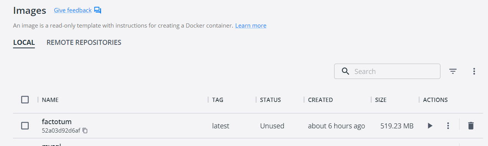

# Dockerizar una aplicación ASP.NET

El objetivo de este tutorial es lograr publicar una imagen de una
solución ASP.NET en un docker. Se sobreentiende que se tiene una 
solución ASP.NET lista para ser publicada y se tiene un docker
donde se quiere colocar la imagen publicada.

La razón por la cual se hará de manera manual es que existen credenciales
y procedimientos de seguridad que no se deben romper y por ende la
automatización no puede ser colocada en un pipeline CI/CD todavía. Esta
tarea será realizada en otro tutorial.

1. Para dockerizar nuestra aplicación lo primero que haremos es pedirle el 
Dockerfile a Visual Studio seleccionando



Luego se le da sí (yes) en todas las opciones siguientes, incluso la que dice 
si queremos sobreescribir el dockerfile que tengamos existente. Eso nos va
a crear un Dockerfile que está listo para publicar nuestra solución.

## Referencias de paquetes que no son públicas

Varias veces en nuestro código utilizamos librerías que se encuentran detrás
de credenciales que tenemos que declarar en algun lugar. El lugar para hacerlo
es el archivo nuget.config del proyecto que tenga estas librerías.

Por ejemplo, el proyecto de la aplicación web utiliza la librería de Telerik,
por lo tanto se debe colocar cómo recuperar esa librería en el nuget.

```
<?xml version="1.0" encoding="utf-8"?>
<configuration>
  <packageSources>
    <add key="Telerik" value="https://nuget.telerik.com/v3/index.json" />
  </packageSources>
  <packageSourceCredentials>
    <Telerik>
      <add key="Username" value="john.smith@artexacta.com" />
      <add key="ClearTextPassword" value="xxxx" />
    </Telerik>
  </packageSourceCredentials>
</configuration>
```
La contraseña en el archivo XML no puede tener caracteres especiales porque
sino no reconoce el archivo como un XML válido.

Para la aplicación de Factotum este paso es entonces obligatorio.

2. Modificar el nuget.config del proyecto WebApplication para que se incluya
la dirección del repositorio de Telerik y las credenciales. 

## Sobre el appsettings para la publicación

Cuando se debe publicar una aplicación ASP.NET Core Visual Studio publica formando
todo el appsettings con la información que tiene en el appsettings original y le
aumenta la información que se tiene en el user secrets. Esto hace que el archivo
resultante funciona en el contexto de la persona que está ejecutando la aplicación.

Para hacer que funcione como imagen en el docker correspondiente se debe trabajar 
con direcciones de archivos que no se encuentran disponibles en el contenedor 
donde se va a ejecutar. Por ello uno tiene que tener la información suficiente para
poder formar un appsettings que uno sepa que puede ejecutarse en la imagen.

Luego de eso es posible que se necesite cambiar alguno de los datos del archivo
appsettings pero eso se puede hacer sin problemas una vez que la imagen está
ejecutándose en el contenedor.

## La regla del Dockerfile para Visual Studio

Para poder crear la imagen básicamente lo que tenemos que hacer es ejecutar
un comando __docker build__ pero en este caso es un poco más elaborado por las
carpetas que se encuentran en la aplicación.

Sin embargo, Visual Studio no arma de manera natural el Dockerfile para la solución
por eso es que tenemos que tomar en cuenta lo siguiente:

* Para ejecutar el comando debemos estar __en la carpeta__ donde está el archivo sln
* Tenemos que indicar en el comando __dónde__ se puede encontrar al Dockerfile. 
Generalmente el archivo se encontrará en la carpeta del proyecto específico.
* Siempre es bueno indicar un nombre para la imagen de salida.

3. Ir a la carpeta donde está el archivo .sln y ejecutar el siguiente comando:

```
\facturacion-electronica-kpmg>docker build -f Development\FacturacionElectronica\WebFacturacion\Dockerfile --force-rm -t factotum .
[+] Building 345.0s (26/26) FINISHED
 => [internal] load build definition from Dockerfile                                                                                                                                                                       0.4s
 => => transferring dockerfile: 32B                                                                                                                                                                                        0.3s
 => [internal] load .dockerignore                                                                                                                                                                                          0.1s
 => => transferring context: 35B                                                                                                                                                                                           0.0s
 => [internal] load metadata for mcr.microsoft.com/dotnet/sdk:6.0                                                                                                                                                          1.0s
 => [internal] load metadata for mcr.microsoft.com/dotnet/aspnet:6.0                                                                                                                                                       1.0s
 => [build  1/15] FROM mcr.microsoft.com/dotnet/sdk:6.0@sha256:700773b3f6a2094e1a063d17cb2fa1f0e2081b118936268238ab0f788cdcefcf                                                                                            0.0s
 => [base 1/2] FROM mcr.microsoft.com/dotnet/aspnet:6.0@sha256:06247362f80d011d8574af9d9a4752c44c5fb1fdd5f8b35dac1a338f6be29b46                                                                                            0.0s
 => [internal] load build context                                                                                                                                                                                          5.3s
 => => transferring context: 1.07MB                                                                                                                                                                                        5.2s
 => CACHED [base 2/2] WORKDIR /app                                                                                                                                                                                         0.0s
 => CACHED [final 1/2] WORKDIR /app                                                                                                                                                                                        0.0s
 => CACHED [build  2/15] WORKDIR /src                                                                                                                                                                                      0.0s
 => [build  3/15] COPY [Development/FacturacionElectronica/WebFacturacion/nuget.config, Development/FacturacionElectronica/WebFacturacion/]                                                                                0.2s
 => [build  4/15] COPY [Development/FacturacionElectronica/WebFacturacion/WebFacturacion.csproj, Development/FacturacionElectronica/WebFacturacion/]                                                                       0.2s
 => [build  5/15] COPY [Development/FacturacionElectronica/Application/Application.csproj, Development/FacturacionElectronica/Application/]                                                                                0.2s
 => [build  6/15] COPY [Development/FacturacionElectronica/Domain/Domain.csproj, Development/FacturacionElectronica/Domain/]                                                                                               0.1s
 => [build  7/15] COPY [Development/FacturacionElectronica/Infrastructure/Infrastructure.csproj, Development/FacturacionElectronica/Infrastructure/]                                                                       0.2s
 => [build  8/15] COPY [Development/FacturacionElectronica/EnvioDeEmauil/EnvioDeEmail.csproj, Development/FacturacionElectronica/EnvioDeEmauil/]                                                                           0.2s
 => [build  9/15] COPY [Development/FacturacionElectronica/ProcesarSolicitudes/ProcesarSolicitudes.csproj, Development/FacturacionElectronica/ProcesarSolicitudes/]                                                        0.2s
 => [build 10/15] COPY [Development/FacturacionElectronica/RecepcionFacturas/RecepcionFacturas.csproj, Development/FacturacionElectronica/RecepcionFacturas/]                                                              0.3s
 => [build 11/15] COPY [Development/FacturacionElectronica/Sincronizacion/Sincronizacion.csproj, Development/FacturacionElectronica/Sincronizacion/]                                                                       0.2s
 => [build 12/15] RUN dotnet restore "Development/FacturacionElectronica/WebFacturacion/WebFacturacion.csproj"                                                                                                           125.7s
 => [build 13/15] COPY . .                                                                                                                                                                                                 2.5s
 => [build 14/15] WORKDIR /src/Development/FacturacionElectronica/WebFacturacion                                                                                                                                           0.2s
 => [build 15/15] RUN dotnet build "WebFacturacion.csproj" -c Release -o /app/build                                                                                                                                      100.7s
 => [publish 1/1] RUN dotnet publish "WebFacturacion.csproj" -c Release -o /app/publish /p:UseAppHost=false                                                                                                               99.9s
 => [final 2/2] COPY --from=publish /app/publish .                                                                                                                                                                         2.9s
 => exporting to image                                                                                                                                                                                                     2.7s
 => => exporting layers                                                                                                                                                                                                    2.6s
 => => writing image sha256:52a03d92d6afa75f62bd38e57a5f8b71654424d9724d46502ece6310c67d4357                                                                                                                               0.0s
 => => naming to docker.io/pub/factotum                                                                                                                                                                                    0.0s

Use 'docker scan' to run Snyk tests against images to find vulnerabilities and learn how to fix them
```
Para saber dónde se encuentra la imagen se puede lanzar el cliente de Docker para listar las imágenes
disponibles y se puede ver la imagen de factotum.



## Llevar la imagen al lugar donde deberá ser publicada

Tenemos que mover esta imagen al docker donde lo queremos publicar.

4. Sacar una copia de la imagen y guardarla en un arcrhivo en nuestro host
```
> docker save -o E:\temp\factotumImage.tar factotum
```
5. Copiar la imagen guardada al host docker de destino. En este caso
usaremos scp
```
E:\temp>scp factotumImage.tar admin@A.A.A.A:/home/admin/backups
admin@A.A.A.A's password:
factotumImage.tar                              14%   71MB   1.3MB/s   05:23 ETA
```
Asegurarse que la copia se realizó de manera correcta conectándose al host
y listando el archivo.

6. Cargar la imagen copiada en el docker de destino para luego ejecutarlo.
```
admin@server:~$ cd backups/
admin@server:~/backups$ ls -al
total 557924
drwxrwxr-x 2 admin admin        95 Jan  5 20:15 .
drwxr-x--- 7 admin admin      4096 Jan  4 20:00 ..
-rw-rw-r-- 1 admin admin  45309952 Jan  4 11:19 factotum2019.bak
-rw-rw-r-- 1 admin admin 525991936 Jan  5 20:23 factotumImage.tar
-rw-rw-r-- 1 admin admin       231 Jan  4 14:32 restoredb.sql
-rw-rw-r-- 1 admin admin       221 Jan  4 14:14 restore.sql

admin@server:~/backups$ docker load -i factotumImage.tar
8a70d251b653: Loading layer [==================================================>]  83.97MB/83.97MB
5047e9061598: Loading layer [==================================================>]   37.3MB/37.3MB
f1307d47d63a: Loading layer [==================================================>]  70.76MB/70.76MB
92b218f57c01: Loading layer [==================================================>]   2.56kB/2.56kB
b400c1fbdfd3: Loading layer [==================================================>]  20.37MB/20.37MB
8ea9595b419e: Loading layer [==================================================>]  2.048kB/2.048kB
5f70bf18a086: Loading layer [==================================================>]  1.024kB/1.024kB
433bcb22055f: Loading layer [==================================================>]  313.5MB/313.5MB
Loaded image: factotum:latest
```

7. en caso de que la imagen ya se encuentre en el sistema docker debe dar de baja
el contenedor y luego la imagen para volver a restaurarla. Esto se logra colocando los comandos

```
docker stop <containerid>
docker rm <containerid>
docker image rm <imageid>
```

7. Ahora solamente queda ejecutar la imagen, para ello se debe colocar el comando
siguiente
```
$ docker-compose up -d 
```
De esta manera se ejecuta la imagen en la misma red que nuestra base de datos.

En vez de hacer eso y para que se habiliten todas las opciones complejas que consisten
en enganchar el contenedor con los volumenes y la red se puede ejecutar el docker-compose.
Ir a la carpeta donde se encuentra el docker-compose.yml que es generalmente en la
carpeta /srv/apps/factotum y ahí se ejecuta ese comando.

8. Reemplazar el contexto con el correcto si es que se lo trajo de otro lugar

Hay algunas cosas que vienen impuestas por nuestro repositorio. En nuestro caso el
appsettings.json de la aplicación viene directamente con el repositorio y se pierde
toda la configuración que cuidadosamente hemos hecho para nuestro entorno de producción.
Para restablecer nuestro appsettings se debe hacer lo siguiente:

```
$ docker cp appsettings.json factotumapp:/app/appsettings.json

$ docker restart factotumapp
```

El restart es necesario para que tome en cuenta el nuevo archivo.


