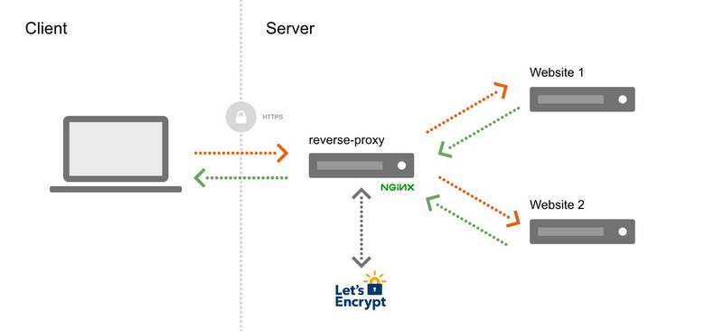

# Hosting de multiples sitios con nginx

El siguiente tutorial es para poder tener multiples sitios
hosteados en una misma máquina Linux. Cada uno de los sitios
está publicado como una imagen de Docker.

El objetivo es que la publicación de cada una de estas imágenes
se hace siempre de la misma manera y es el proxy inverso que 
se encarga de la redirección dependiendo del nombre de dominio
que solicite el cliente al momento de la consulta.

Se puede ver la arquitectura en el diagrama siguiente:



## Base de datos

Ya tenemos un contenedor con una base de datos de SqlServer que está
ejecutándose en una red docker. Esta base de datos se puede poner a 
disposición de los demás sitios para no replicar todo un motor de 
base de datos en nuestro servidor.

Entonces, solamente es necesario colocar correctamente las credenciales
en el appsettings para el string de conexión para que se pueda conectar
cuando se ejecute la imagen en un contenedor.

```
"ConnectionStrings": {
	"DBConnectionString": "Data Source=A.A.A.A;Initial Catalog=dbname;User Id=xxx;Password=yyy;Encrypt=False"
}
```
En general se debe colocar el tema de Encrypt a falso para evitar tener
que configurar certificados para la conexión entre sitios que se supone 
que están seguros.

## Archivos externos de los sitios 

Una aplicación web tiene 3 componentes principales:

* La aplicación web como tal que debe ser reemplazada cada vez que tenemos una nueva versión.
* La base de datos donde se guarda la información relacional de la aplicación.
* Los archivos de configuración y los archivos que produce o adquiere la aplicación por el uso natural de la misma.

Cada vez que la imagen de docker es actualizada, si los archivos se encuentran dentro de la imagen,
éstos serían cambiados y se pierde toda la información que se tiene de configuración o de la información
de archivos que se han subido al sistema o producido por el sistema.

Las carpetas donde se guardan estos se llaman volúmenes en docker. Para nuestro caso 
vamos a preparar las siguientes carpetas:

* __/srv/apps/xxx/files__: donde xxx es el nombre de la aplicación. Se tendrá una carpeta diferente
para cada aplicación.
* __/srv/apps/xxx/logs__: donde xxx es el nombre de la aplicación. Se tendrá una carpeta diferente
para los logs.
* __/srv/apps/xxx/config__: donde xxx es el nombre de la aplicación. Se tendrá una carpeta diferente
para los archivos de configuración que se necesiten

## Sobre el backup 

Es importante poder tener un backup de toda la información que se produce en el server. Existe
una forma bastante sencilla de hacerlo y es replicar toda la información a un Dropbox. De esta 
manera siempre se tiene la información de los archivos de las aplicaciones. Y por la manera de 
tener una sola carpeta para todo entonces es fácil configurar para que se replique en Dropbox.

Básicamente también se puede tener un volumen para la imagen de la base de datos y se puede 
crear un script para hacer un backup de cada una de las bases de datos y luego esos backups 
pasan directamente a Dropbox por el volumen que se comparte para cada uno.

# Instalación del nginx-proxy

Lo primero que haremos es crear las carpetas, para ello nos ayudaremos de un pequeño script

```
# 0. settings
web_dir=/srv/apps/nginx
myusername=administrator
# 1. Create the website directory
sudo mkdir -p $web_dir
# 2. set your user as the owner
sudo chown -R $myusername $web_dir
# 3. set the web server as the group owner
sudo chgrp -R www-data $web_dir
# 4. 755 permissions for everything
sudo chmod -R 755 $web_dir
# 5. New files and folders inherit
# group ownership from the parent folder
chmod g+s $web_dir
```

Se crea entonces el folder para la primera aplicación que será nuestro nginx. Guardar este archivo
con cualquier nombre e.g. nginxCreateFolders.sh

1. Ejecutar el archivo. Para ello se debe cambiar los permisos para que se pueda ejecutar

```
> chmod 754 nginxCreateFolders.sh
> ./nginxCreateFolders.sh
```

2. Crear la carpeta de www en el srv para traer una plantilla para poder crear nuestro nginx

```
> sudo mkdir /srv/www
> cd /srv/www
> sudo git clone https://github.com/kassambara/nginx-multiple-https-websites-on-one-server .
```

Así se crea todo dentro de la carpeta www.

3. Revisar que se encuentren los archivos

Dentro de la carpeta nginx-proxy se pueden encontrar 4 carpetas vacías:
conf.d, vhost.d, html and certs. Estas carpetas son usadas para guardar el nginx y
los archivos de configuración de Let’s Encrypt.

4. Modificar el docker-compose.yml para que tome en cuenta la red artexactanet

5. Ejecutar en la misma carpeta de nginx-proxy el comando

docker-compose up -d

$ docker-compose up -d
Pulling nginx (nginx:)...
latest: Pulling from library/nginx
3f4ca61aafcd: Pull complete
50c68654b16f: Pull complete
3ed295c083ec: Pull complete
40b838968eea: Pull complete
88d3ab68332d: Pull complete
5f63362a3fa3: Pull complete
Digest: sha256:0047b729188a15da49380d9506d65959cce6d40291ccfb4e039f5dc7efd33286
Status: Downloaded newer image for nginx:latest
Pulling nginx-gen (jwilder/docker-gen:)...
latest: Pulling from jwilder/docker-gen
c158987b0551: Pull complete
5967a9ebe3e7: Pull complete
ff0cf581e831: Pull complete
1e72b2cf9b7d: Pull complete
Digest: sha256:d23d1ffac7aa22318126725c6cb373b3651bd78f11136004321cb7e99e96d7dd
Status: Downloaded newer image for jwilder/docker-gen:latest
Pulling nginx-letsencrypt (jrcs/letsencrypt-nginx-proxy-companion:)...
latest: Pulling from jrcs/letsencrypt-nginx-proxy-companion
c158987b0551: Already exists
e5c6df4d1ec2: Pull complete
8292ad08e291: Pull complete
c2f58d41b889: Pull complete
9cafca684d89: Pull complete
e10cd7bed03a: Pull complete
4f4fb700ef54: Pull complete
Digest: sha256:aa12029f6571e8298f7f10642aac9b6ffa9ee2d258a8c514d67ce31e755b6db2
Status: Downloaded newer image for jrcs/letsencrypt-nginx-proxy-companion:latest
Creating nginx-gen         ... done
Creating nginx             ... done
Creating nginx-letsencrypt ... done


