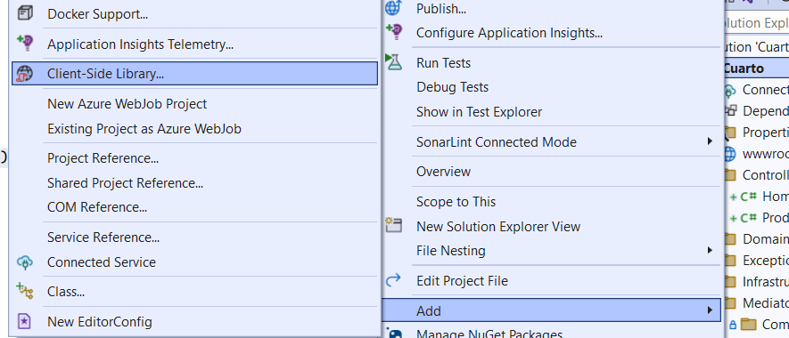
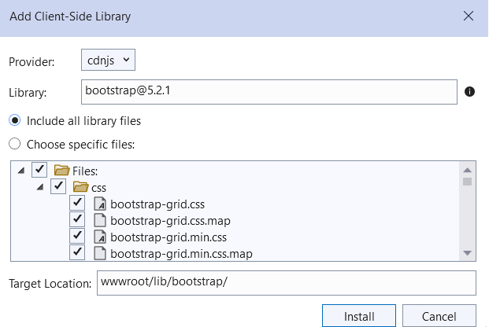
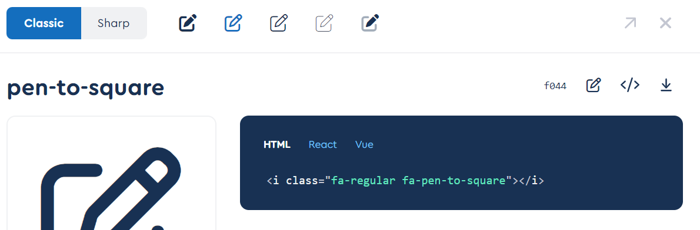
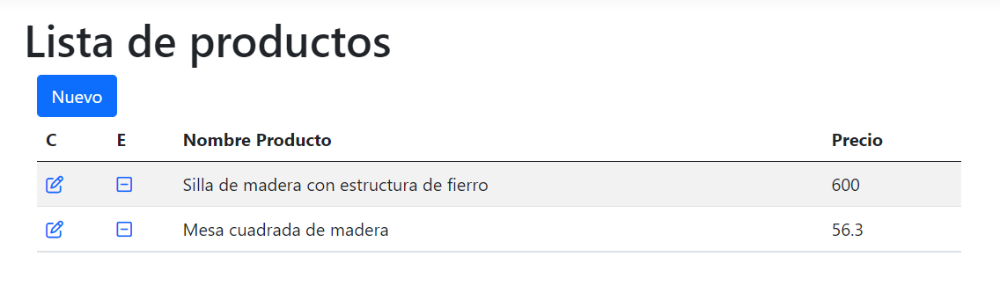

# Patrón Mediator y Bootstrap en frontend

## Objetivo de este ejercicio

El objetivo es poder crear una aplicación web asp.net core que haga
un ABM sencillo. Para hacerlo diferente de ejercicios posteriores
se verá cómo se puede implementar el patrón mediator para los llamados
a nuestros comandos.

Adicionalmente el ejercicio tratar;a de mostrar una interfaz intuitiva
y llamativa para mostrar que se puede hacer un frontend agradable y 
responsivo para el usuario final.

## Mediator

Este patrón juega un rol muy importante en la arquitectura limpia. 
Aquí la definición del patrón.

Este patrón ejecuta el handler o controlador definido cuando le
pasamos una consulta o un comando. La forma en que realiza esto es 
de la siguiente manera:

* Se define un objeto de tipo Request (consulta o comando)
* Se define un objeto de tipo RequestHandler o controlador de la consulta / comando.
* En el código del controlador se hace uso de los atributos de la consulta
como parámetros para la funcionalidad que deseamos implementar. 
* Para ejecutar, solamente se llama al mediator pasándole la consulta / comando.

### Consulta / Comando

Dependiendo de lo que se quiera solicitar, se coloca la clase que 
representa a esta Consulta o Comando en la carpeta Commands o Requests.
```
namespace Cuarto.Mediator.Commands
{
    public class EliminarProductoCommand : IRequest<bool>
    {
		...
	}
}
```
La interfaz IRequest está dada por la librería Mediator y sirve para
marcar la clase (ya que no hay que implementar nada) y que el motor
de Mediator sepa cuáles objetos son los que se tomarán en cuenta como
Requests.

Dentro de la especificación del tipo en la interfaz se debe a que ahí
se indica el tipo de respuesta que se espera de la implementación del
controlador.

### Controlador de la consulta o comando

En el caso del controlador se crea una clase que implementa IRequestHandler.
En la indicación del tipo se encuentra la clave para que Mediator 
pueda saber cual controlador aqtiene cual consulta.
```
namespace Cuarto.Mediator.Handlers
{
    public class EliminarProductoHandler : 
		IRequestHandler<EliminarProductoCommand, bool>
    {
        ...

        public async Task<bool> Handle(
			EliminarProductoCommand request, 
			CancellationToken cancellationToken)
        {
            ...
        }
    }
}
```

### Uso del mediator

La manera de usarlo es bastante sencilla y de ahí lo poderoso de este
patrón de diseño. Todo lo que se tiene que hacer es llamar al método
Send del objeto mediator que nos es asignado por inyección de 
dependencias:
```
EliminarProductoCommand cmd = 
	new EliminarProductoCommand(modalEliminarId);
bool resultado = await _mediator.Send(cmd);
```

### Razón principal para usar mediator

El mediator se utiliza principalmente para agrupar operaciones. El objetivo
es que desde el controlador u otro lugar solamente se llame a una
función del mediator y este realice todas las operaciones. 

Esto también permite que se puedan realizar inserciones, actualizaciones
y otras operaciones y solamente al final del código del mediator
se llame al commit del patrón de Unit of Work.

Por otro lado, se sugiere que como los objetos resultados se van a utilizar
para la interfaz de usuario u otras; entonces se debe utilizar como 
respuesta los objetos de tipo ViewModel.

## Bootstrap

Es una librería creada originalmente por Twitter que permite crear
sitios responsivos de manera sencilla. Es muy importante aprender el 
manejo de esta librería ya que permite crear formularios con elementos
gráficos que han sido cuidadosamente retocados con CSS para crear
vistas agradables.

### Grids

Quizá lo más importante que hay que aprender es el manejo de los grids.
Esto será lo que utilicemos para organizar los elementos de una página 
en una o más columnas de manera que se vean correctamente sin importar
el tamaño de la página.

En todo momento se puede definir una fila (row) en un div. Esta fila 
estará siempre dividida en 12 columnas. Cada columna que coloquemos
indica el tamaño respecto de las 12 columnas disponibles.

Por ejemplo, una fila con dos columnas que ocupen 5 y 4 espacios de la 
fila respectivamente se hace de esta manera:
```
<div class="row">
	<div class="col-md-5">
		Texto en la columna de 5 espacios
	</div>
	<div class="col-md-4">
		Texto en la columna de 4 espacios
	</div>
</div>
```
Encontrará más información detallada en la dirección 
https://getbootstrap.com/docs/5.2/getting-started/introduction/

### Modals

Este es un componente que es muy importante manejarlo correctamente para
crear una interesante interacción con el usuario. 

Para crear uno solamente se debe definir un div dentro de la página. Este 
div por defecto, y gracias a los CSS y JS de Bootstrap no se mostrará en 
página hasta que se indique que se debe mostrar:

```
<div class="modal" tabindex="-1" id="modalEliminar">
  <div class="modal-dialog">
    <div class="modal-content">
      <div class="modal-header">
        <h5 class="modal-title">
			TITULO
		</h5>
        <button type="button" 
			class="btn-close" 
			data-bs-dismiss="modal" 
			aria-label="Cerrar"></button>
      </div>
      <div class="modal-body">
        <p>Texto dentro del modal</p>
      </div>
	  <div class="modal-footer">
		<button type="button" 
			class="btn btn-secondary" 
			data-bs-dismiss="modal">Cancelar</button>
		<button type="submit" 
		class="btn btn-primary">Eliminar</button>
	  </div>
    </div>
  </div>
</div>
```

Se puede ver que se tienen diferentes bloques donde se colocan las diferentes
partes de la ventana que se mostrará al cliente.

Para poder indicar que el modal debe mostrarse podemos enlazar a un
evento de clic en alguno de los componentes de la página.

```
$(function() {
    $('.btnEliminar').click(function(e) {
        e.preventDefault();
        $('#modalEliminar').modal('show');

        return false;
    });
});
```

En el manejador del evento se busca por identificador al div que contiene el
modal y lo único que se debe hacer es dar el parámetro show a la función modal.

## Jquery

Esta es una librería Javascript que nos permite encontrar de manera un poco 
más sencilla los objetos de la página. Actualmente está cayendo en desuso 
pero todavía está ampliamente utilizado por los componentes de bootstrap
y también por los componentes de otras librerías que tienen que ver con interfaz
de usuario.

## Secciones diferentes en el layout

1. Crear un proyecto de una aplicación a partir de la plantilla de proyecto
ASP.NET Core Web App.

2. Incorporar en ese proyecto una librería de cliente llamada bootstrap. Esto se 
logra eligiendo la opción para librería de cliente del menú contextual como se 
ve en la figura.



Y luego en el buscador que aparece se coloca bootstrap y se elige la opción que 
instalará todo bootstrap.



Esto copiará muchos archivos y carpetas en nuestra carpeta wwwroot donde se
coloca todo el contenido estático de la aplicación web.

3. Incorporar en el proyecto la librería de cliente JQuery. Realizar la misma
operación del paso anterior pero para jquery.

4. Asegurarse que se llama a bootstrap y a jquery desde todas las páginas. 
Tal como vimos en el primer ejercicio, la página de Layout tiene la información 
que tendrán todas las páginas de la aplicación web. 

Al final de la página, antes de la sección de Scripts deben haber las líneas:
```
<script src="~/lib/jquery/dist/jquery.min.js"></script>
<script src="~/lib/bootstrap/dist/js/bootstrap.bundle.min.js"></script>
```

## Font-awesome

5. Instalar la librería de font-awesome para tener una lista de íconos
profesional acorde con la librería bootstrap elegida. Esta se instala
de la misma manera que las anteriores.
6. Asegurarse de llamar a la librería de los íconos desde el Layout de la
aplicación. Desde el head del Layout debe llamarse a la familia de íconos
```
<link rel="stylesheet" href="~/lib/font-awesome/css/all.css" />
```
Si tuviera algun problema puede revisar la documentación para realizar
esta operación [aquí](https://sigitov.de/how-to-add-font-awesome-to-an-asp-net-core-web-application-core-version-2-0-and-higher/).

## Replicar el proyecto Tercero

7. Copiar toda la parte de Repositorio y Dominio / Modelo del proyecto
Tercero a este proyecto.

## Implementar el mediator para las operaciones

8. Implementar el mediator en nuestro proyecto. Lo primero que se debe
hacer es incorporar el paquete nuget MediatR DependencyInjection. Este ya
traerá el paquete MediatR correspondiente.

9. Colocar la referencia en Program para que se inicialice el servicio
```
builder.Services.AddMediatR(Assembly.GetExecutingAssembly());
```

10. Crear el comando de Insertar nuevo producto en la clase 
InsertProductoCommand que colocaremos en una carpeta Commands dentro
de la carpeta Mediator.
```
public class InsertProductoCommand : IRequest<Guid>
{
	public ProductoViewModel NuevoProducto { get; set; }
	public InsertProductoCommand(ProductoViewModel p)
	{
		NuevoProducto = p;
	}
}
```

11. Crear el controlador para el comando de insertar un producto. Este
controlador hace uso del repositorio, el mapper de Automapper que se vio 
en el anterior proyecto, y el unit of work. Aquí vemos la parte de 
de implementación del método que implementa la interfaz de Mediator.
```
public async Task<Guid> Handle(InsertProductoCommand request, 
	CancellationToken cancellationToken)
{
	Producto nuevo = _mapper.Map<Producto>(request.NuevoProducto);
	Guid nuevoGuid = await _productoRepository.Insert(nuevo);
	await _unitOfWork.Commit();

	return nuevoGuid;
}
```

12. Crear el comando de actualizar un producto en la clase 
EditProductoCommand que colocaremos en una carpeta Commands dentro
de la carpeta Mediator.
```
public class EditProductoCommand : IRequest<ProductoViewModel>
{
	public ProductoViewModel ProductoEditar { get; set; }

	public EditProductoCommand(ProductoViewModel productoEditar)
	{
		ProductoEditar = productoEditar;
	}
}
```

13. Crear el controlador para el comando de actualizar producto. Este
controlador hace uso del repositorio, el mapper de Automapper que se vio 
en el anterior proyecto, y el unit of work. Aquí vemos la parte de 
de implementación del método que implementa la interfaz de Mediator.
```
public async Task<ProductoViewModel> Handle(EditProductoCommand request, 
	CancellationToken cancellationToken)
{
	Producto aEditar = _mapper.Map<Producto>(request.ProductoEditar);
	Producto? editado = _productoRepository.Update(aEditar);
	if (editado == null)
	{
		return null;
	}
	else
	{
		await _unitOfWork.Commit();
	}
	return _mapper.Map<ProductoViewModel>(editado);
}
```

14. Crear el comando de eliminar un producto en la clase 
EliminarProductoCommand que colocaremos en una carpeta Commands dentro
de la carpeta Mediator.
```
public class EliminarProductoCommand : IRequest<bool>
{
	public Guid Id { get; set; }
	public EliminarProductoCommand(Guid id)
	{
		Id = id;
	}
}
```

15. Crear el controlador para el comando de eliminar producto. Este
controlador hace uso del repositorio, el mapper de Automapper que se vio 
en el anterior proyecto, y el unit of work. Aquí vemos la parte de 
de implementación del método que implementa la interfaz de Mediator.
```
public async Task<bool> Handle(EliminarProductoCommand request, 
	CancellationToken cancellationToken)
{
	_productoRepository.Delete(request.Id);
	await _unitOfWork.Commit();
	return true;
}
```

16. Crear la consulta para obtener una lista de productos en la clase
GetProductosQuery que colocaremos en una carpeta Queries dentro
de la carpeta Mediator.
```
public class GetProductosQuery : IRequest<List<ProductoViewModel>>
{
}
```

17. Crear el controlador para la consulta de obtener una lista de productos. 
Este controlador hace uso del repositorio y el mapper de Automapper.
Aquí vemos la parte de 
de implementación del método que implementa la interfaz de Mediator.
```
public async Task<List<ProductoViewModel>> Handle(GetProductosQuery request, 
	CancellationToken cancellationToken)
{
	return await Task.Run(() =>
	{
		List<Producto> productos = _productoRepository.GetProductos("");
		List<ProductoViewModel> result = new List<ProductoViewModel>();
		foreach (Producto p in productos)
		{
			result.Add(_mapper.Map<ProductoViewModel>(p));
		}
		return result;
	});
}
```
Los métodos de los controladores de mediator son asíncronos y si el código
dentro del controlador no necesita un await se debe ejecutar en un Task 
aparte y hacer await sobre ese Task como se ve en el código anterior.

18. Crear la consulta para obtener un producto pasando el id del producto.
La clase se puede llamar GetProductoByIdQuery que colocaremos en una carpeta 
Queries dentro de la carpeta Mediator.
```
public class GetProductoByIdQuery : IRequest<ProductoViewModel>
{
	public Guid Id { get; set; }
	public GetProductoByIdQuery(Guid id)
	{
		Id = id;
	}
}
```

19. Crear el controlador para la consulta de obtener un producto por id.
Este controlador hace uso del repositorio y el mapper de Automapper.
Aquí vemos la parte de 
de implementación del método que implementa la interfaz de Mediator.
```
public async Task<ProductoViewModel> Handle(GetProductoByIdQuery request, 
	CancellationToken cancellationToken)
{
	Producto p = await _productoRepository.GetProductoById(request.Id);
	if (p == null)
		throw new ArgumentException("No existe ese producto");
	return _mapper.Map<ProductoViewModel>(p);
}
```

## Implementar el ciclo controlador / vista para la lista de Productos

20. Asegurarse que todas las páginas tendrán el mismo layout. Esto se 
puede ver en el archivo ViewStart de la carpeta Views.
```
@{
    Layout = "_Layout";
}
```

21. Crear el método Index en ProductoController usando exclusivamente el 
mediator para que desde el controlador no tengamos injerencia sobre el 
dominio.
```
[HttpGet]
public async Task<IActionResult> Index()
{
	List<ProductoViewModel> modelo = 
		await _mediator.Send(new GetProductosQuery());
	return View(modelo);
}
```
El llamado al mediator simplifica enormemente los métodos del controlador
y nos permite enfocarnos en los objetos que recibirá la vista.

El método tiene una anotación **HttpGet** que indica que este método solamente 
puede ser accedido por la acción GET del protocolo HTTP. Significa que si 
llamamos a este método desde un POST (lo que hacemos típicamente en un form)
no podrá encontrar ningún método que pueda atender esa llamada.

21. Crear la vista en la carpeta Views/Producto bajo el nombre Index.cshtml. 
Colocar el modelo List<ProductoViewModel> 
```
@model List<Cuarto.ViewModels.ProductoViewModel>
<h1>Lista de productos</h1>
...
```

22. Luego de colocar el título y colocar una tabla hacer una bucle para 
que se muestren los datos de cada Producto. Si no hay productos que aparezca
el mensaje correspondiente.
```
@if (Model.Count > 0)
{
	foreach(var item in Model)
	{
		<tr>
			<td>
				<a asp-action="Edit" asp-route-id="@item.Id" class="text-decoration-none">
					<i class="fa-regular fa-pen-to-square"></i>
				</a>     
			</td>
			<td>
				<a href="#" class="text-decoration-none btnEliminar" data-id="@item.Id">
					<i class="fa-regular fa-square-minus"></i>
				</a>                                     
			</td>
			<td>@item.Nombre</td>
			<td>@item.Precio</td>
		</tr>
	}
}
else
{
	<tr>
		<td colspan="4">No hay productos</td>
	</tr>
}
```
La primera columna es para el botón de Editar un producto. En el botón 
se puede ver la manera en que se indica la acción y el parámetro (asp-route)

También se puede ver la forma en que se utilizan los íconos de la librería y 
se los llama de acuerdo al código que tienen en la página donde se busca
el ícono [fontawesome](https://fontawesome.com/icons/pen-to-square?s=regular&f=classic)



23. Revisar el resultado correcto de la página. Se debe ejecutar la aplicación
y navegar a la dirección Producto/Index. Esta vista ya tiene una vista profesional
y responsive que se adapta al tamaño de cualquier dispositivo y se ve naturalmente
bien en cualquier pantalla.



## Implementar el ciclo controlador / vista para la inserción 

24. Al principio de hacer una inserción, el formulario para la inserción
debe estar vacío. Pero se debe llamar a la vista de Insertar. Entonces, la
diferencia es que para llamar al formulario vacío se hace un GET y para 
pasar el parámetro Producto del formulario se hace un POST. Crear el método
Insert para el método HttpGet.
```
[HttpGet]
public IActionResult Insert()
{
	return View();
}
```

25. Crear la vista que tiene el formulario para insertar un producto. Lo
primero es colocar el modelo que es un ProductoViewModelo
```
@model Cuarto.ViewModels.ProductoViewModel

<h1>Nuevo Producto</h1>
```

26. Crear el formulario para llamar a Insert, pero esta vez con el método
POST. Todo lo que esté dentro del formulario se mapeará al modelo de la
página.
```
<form asp-action="Insert" method="post">
    ...
</form>
```

27. Definir cada uno de los campos del formulario mapeando directamente al 
atributo del modelo que corresponda.
```
<div class="mb-3">
	<label class="form-label">Nombre</label>
	<input class="form-control" asp-for="Nombre" />
</div>
<div class="mb-3">
	<label class="form-label">Precio</label>
	<input class="form-control" asp-for="Precio" />
</div>    
<div class="mb-3">
	<label class="form-label">Fecha Venc</label>
	<input class="form-control" asp-for="FechaVencimiento" />
</div>    
<div class="mb-3">
	<label class="form-label">Cantidad</label>
	<input class="form-control" asp-for="Cantidad" />
</div>    
<div class="mb-3">
	<label class="form-label">Estado</label>
	<input class="form-control" asp-for="Estado" />
</div>
```
El uso de asp-for enlaza el campo con el atributo de nuestro modelo.
Esto permite incluso crear un componente visual adecuado para ese
atributo dependiendo de su tipo.

28. Crear el botón que envía toda la información a la acción Insert
con el método POST.
```
<div class="mb-3">
	<button type="submit" class="btn btn-primary mb-3">Crear</button>
</div>
```

29. Crear la acción Insert en el controlador para el método POST 
usando exclusivamente el mediator. En este caso, al insertar un nuevo producto, 
nos pasarán un parámetro que es justamente el ViewModel del producto.
```
[HttpPost]
public async Task<IActionResult> Insert(ProductoViewModel p)
{
	Guid nuevo = await _mediator.Send(new InsertProductoCommand(p));
	return RedirectToAction(nameof(Edit), new { id = nuevo });
}
```
En este método se puede ver que el objeto nuevo se toma como parámetro y
viene en una llamada POST de HTTP (típicamente de un form). Luego de 
realizar la inserción redireccionamos a editar ese producto con el 
nuevo id que se acaba de crear.

30. En el Index se debe configurar la llamada al Insert del método GET para que
nos muestre el formulario vacío la primera vez. Esto lo hacemos en el botón
Nuevo que aparece luego del título.
```
<a asp-action="Insert" class="btn btn-primary">Nuevo</a> 
```

## Implementar el ciclo controlador / vista para la edición o actualización

31. Verificar que en la vista de la lista de productos se puede ver el botón
para editar el producto y que llama con un argumento que tiene el id del producto
```
<a asp-action="Edit" asp-route-id="@item.Id" class="text-decoration-none">
	<i class="fa-regular fa-pen-to-square"></i>
</a>
```
Esto nos da la pauta de que la acción se debe llamar Edit y que debe aceptar
un id. Esta acción debe responder al método GET. 

32. Crear el método Edit para el método HttpGet.
```
[HttpGet]
public async Task<IActionResult> Edit(Guid id)
{
	ProductoViewModel model = 
		await _mediator.Send(new GetProductoByIdQuery(id));
	return View(model);
}
```

32. Crear la vista que tiene el formulario para editar un producto. Este formulario
es muy similar al de Insertar un producto solamente que existe un input de tipo
hidden que tiene el id del Producto. Esto se puede ver en el archivo Edit.cshtml
de la carpeta Views/Producto
```
<form asp-action="Edit" method="post">
	<input asp-for="Id" type="hidden" />
	...
</form>
```

33. Crear la acción Edit en el controlador para el método POST 
usando exclusivamente el mediator. Como se vio en el Insert, aquí también 
se espera como parámetro los nuevos valores del objeto a actualizar
```
[HttpPost]
public async Task<IActionResult> Edit(ProductoViewModel p)
{
	EditProductoCommand cmd = new EditProductoCommand(p);
	ProductoViewModel actualizado = await _mediator.Send(cmd);
	return RedirectToAction(nameof(Edit), new { id = actualizado.Id });
}
```
Por supuesto, al final se vuelve a la página de edición limpia de ese Producto
que es justamente la acción Edit con el método GET.

## Implementar el ciclo controlador / vista para eliminar un producto

34. En cada una de las filas que se muestra el producto asegurarse que está el
enlace para eliminar un producto. En este caso no se utiliza una acción GET y
solamente se marca el botón con la clase btnEliminar.
```
<a href="#" class="text-decoration-none btnEliminar" data-id="@item.Id">
	<i class="fa-regular fa-square-minus"></i>
</a>
```

35. La razón para hacer de esas manera el anterior paso es que queremos mostrar
el modal con la confirmación para eliminar un producto. Entonces debemos programar
el evento clic de este botón para que muestre el modal. Esto se realiza al final de
la vista Index
```
@section Scripts {
	<script type="text/javascript">
		$(function() {
			$('.btnEliminar').click(function(e) {
				e.preventDefault();
				$('#modalEliminarId').val($(this).data('id'));
				$('#modalEliminar').modal('show');

				return false;
			});
		});
	</script>
}
```

Para que el formulario tenga la información correcta, se coloca el valor del id
en el campo hidden que está dentro del formulario del modal que llama e eliminar.

36. Crear el modal con el identificador correcto que mostrará el mensaje de
confirmación de eliminación. Este modal tiene un form adentro que llama a la
acción Eliminar.
```
<div class="modal" tabindex="-1" id="modalEliminar">
  <div class="modal-dialog">
    <div class="modal-content">
      <div class="modal-header">
        <h5 class="modal-title">Confirmación eliminación</h5>
        <button type="button" class="btn-close" data-bs-dismiss="modal" aria-label="Close"></button>
      </div>
      <div class="modal-body">
        <p>Está usted seguro que desea eliminar este producto?</p>
      </div>
      <form method="get" asp-action="Eliminar">
          <input type="hidden" id="modalEliminarId" name="modalEliminarId" value="" />
          <div class="modal-footer">
            <button type="button" class="btn btn-secondary" data-bs-dismiss="modal">Cancelar</button>
            <button type="submit" class="btn btn-primary">Eliminar</button>
          </div>
      </form>
    </div>
  </div>
</div>
```

37. Crear la acción Eliminar para el método GET en el controlador de Producto. 
En el código hacer uso de mediator y devolver la lista de productos (redirección
a Index)
```
[HttpGet]
public async Task<IActionResult> Eliminar(Guid modalEliminarId)
{
	EliminarProductoCommand cmd = new EliminarProductoCommand(modalEliminarId);
	bool resultado = await _mediator.Send(cmd);

	if (!resultado)	{ 
		// error deleting
	}

	return RedirectToAction(nameof(Index));
}
```