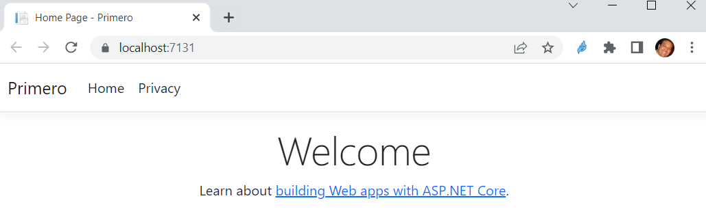

# Primero

Para este primer programa se deben realizar las siguientes operaciones:

## Crear un proyecto nuevo 
1. Crear un proyecto en VS 2022 con la plantilla de ASP.NET WEb (Controladores y Vistas)
2. Entender el archivo Program.cs
3. Entender el ciclo de llamado a página web - controlador - vista
4. Entender lo que hace VS cuando ejecuta la aplicación y que la misma es un EXE




## Entender el tema de Modelo - Vista - Controlador 
5. Identificar el método del controlador que se ejecuta cuando se lanza la aplicación web

```
public IActionResult Index()
{
	PersonaViewModel persona = new PersonaViewModel();
	persona.Nombre = "Juan PErez";
	persona.Edad = 45;
	return View(persona);
}
```
6. Como se vio, cambiar el método para que se llame a un objeto ViewModel
7. El objeto ViewModel se crea en la carpeta Models, en realidad es una clase normal
```
public class PersonaViewModel
{
	public string Nombre { get; set; }
	public int Edad { get; set; }
}
```
8. Indicar en la vista que el modelo va a ser usado en ella. Esto se realiza
en el archivo Index.cshtml (nombre del método) de la Views, en la carpeta Home (nombre del controlador)

```
@model Primero.Models.PersonaViewModel
```
9. Darse cuenta que todo en ASP.NET son convenciones de nombre para que 
la funcionalidad se vea beneficiada y no sean necesarias configuraciones
adicionales.
10. Usar el objeto ViewModel en el archivo Index, usando la variable 
disponible Model.
```
<ul>
	<li>Una persona reportando, nombre: @Model.Nombre</li>
	<li>Y la edad: @Model.Edad</li>
</ul>
```

## Inyección de Dependencias

11. Entender que todo son servicios en ASP.NET y que estos servicios se 
pueden utilizar en cualquier momento haciendo referencia a sus interfases
solamente.
12. Crear una interfaz de un servicio cualquiera, por ejemplo, hacer la
inversa de un nombre. Esto en la carpeta SErvices
13. Hacer uso del servicio colocando una variable del tipo de la interfaz
en el controlador y asignando en el constructor el parámetro, siempre como
interfaz.
```
private readonly ILogger<HomeController> _logger;
private readonly IReversaString _reversaString;

public HomeController(ILogger<HomeController> logger, 
	IReversaString reversaString)
{
	_logger = logger;
	_reversaString = reversaString;
}
```
14. Crear la implementación en la carpeta Implementations, esto en el archivo que respeta
el nombre que ya se dio en la interfaz ReversaString (sin la I)
```
public class ReversaString : IReversaString
{
	public string Reversa(string fuente)
	{
		return String.Concat(fuente.Reverse());
	}
}
```
15. Usar el servicio en el método del controlador. Directamente siempre
usando la interfaz
```
public IActionResult Index()
{
	PersonaViewModel persona = new PersonaViewModel();
	persona.Nombre = "Juan PErez";
	persona.Edad = 45;
	persona.NombreInverso = _reversaString.Reversa(persona.Nombre);
	return View(persona);
}
```
16. Ahora sí, indicar al motor de inyección de dependencias cual es la
implementación que debe usar cuando el controlador solicita en el 
constructor un objeto de tipo IReversaString. Esto se hace en el Program.cs
antes de que se haga build de la aplicación:
```
using Primero.Implementations;
using Primero.Services;

var builder = WebApplication.CreateBuilder(args);

// Add services to the container.
builder.Services.AddControllersWithViews();

builder.Services.AddScoped<IReversaString, ReversaString>();

var app = builder.Build();
```
17. Entender que existen 3 formas de indicar la dependencia. 
	* Scoped: En cada thread creado al llamar al Request de Http se crea el objeto
	* Singleton: Solamente se crea una vez y se reutiliza siempre el mismo
	* Transient: Se crea cada vez que se lo necesita, si en un mismo Request se lo necesita 3 veces, se crea 3 veces el objeto

