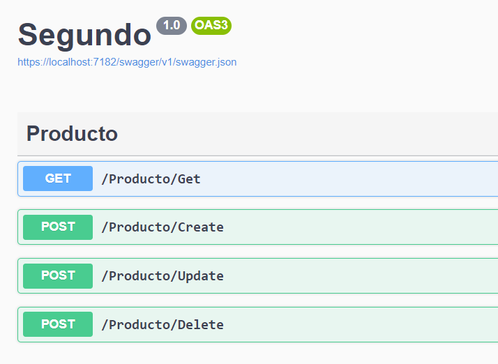
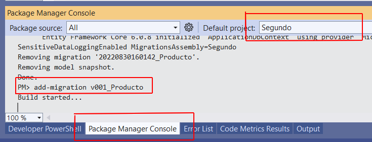
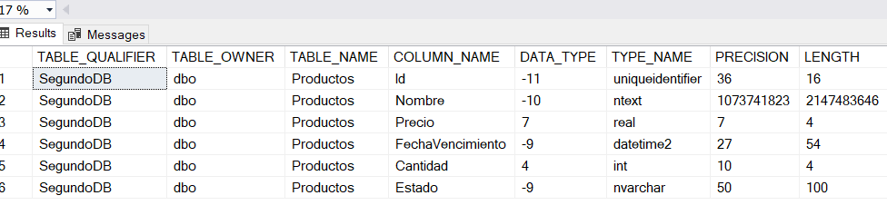

# Patrón Repository 

## Objetivo de este ejercicio

Vamos a crear una aplicación que publica 4 servicios web que tienen la
siguiente forma:



Cada uno de estos servicios tiene una funcionalidad bastante clara y 
evidente que estará programada en las implementaciones del patrón. 

Por la naturaleza del patrón se hará incluso que la información sea 
sacada a partir de una base de datos Sql Server.

## Servicios web

Los servicios web son aplicaciones web que permiten que otros programas
hagan consultas a estas aplicaciones desde el mismo código. No es necesaria
ninguna intervención humana para que una aplicación consuma un servicio
web.

Generalmente se usan para poder integrar funcionalidades entre diferentes 
aplicaciones. Por ejemplo, es posible que en nuestra página web querramos
colocar en una esquina un elemento que muestre el clima. Solamente se 
debe llamar a un servicio web que provea esa información y nuestra aplicación
sólamente debe consumir ese servicio web y puede mostrar la información
de manera adecuada en nuestro elemento.

Vamos a ver 3 maneras de consumir estos servicios para un testeo rápido.

### Consumir desde el mismo sitio

La interfaz que nos presenta el mismo sitio se llama swagger. Esta interfaz
permite leer los servicios y presentar una interfaz web de los mismos que nos
permite hacer un test rápido.

No importa si los servicios necesitan argumentos o no, la interfaz tiene
todo lo necesario para hacer la llamada con el botón Try it out.

### Consumir desde consola

Se debe instalar la herramienta curl para consola. Luego, en una consola
se coloca:

```
>curl -X "GET" "https://localhost:7182/Producto/Get" -H "accept: text/plain"
[{"id":"0d38f558-f39d-4cd5-b092-acbb131f336d","nombre":"Insecticida","precio":65.4,"fechaVencimiento":"2023-06-06T00:00:00"},{"id":"b1958665-0d55-477b-bc59-b2eb1be8e063","nombre":"Aspirina","precio":5.36,"fechaVencimiento":"2022-10-23T04:03:20.896"}]
```
Si formateamos la respuesta en un JSON en cualquier página veremos un
conjunto de objetos donde cada uno tiene propiedades de id, nombre, 
precio y fechaVencimiento.

### Consumir desde Postman

Instalar la herramienta de Postman en su computadora. Esta herramienta
le permite definir cuales serán sus consultas y tenerlas por grupos
de aplicaciones. En la dirección del pedido colocar la dirección local
de su servidor de desarrollo, colocar los argumetnos si fuera necesario
y finalmente hacer clic en Send para enviar. 

La respuesta llega en formato JSON y es formateada automáticamente por la
herramienta


## Crear la aplicación vacía

1. Crear una aplicación con la plantilla de ASP.NET Core Web API 

2. Instalar los siguientes paquetes nuget en la aplicación. En el nombre 
del proyecto, con el botón derecho del ratón, ir a la opción de Administración
de Paquetes Nuget.
	* EntityFrameworkCore
	* EntityFrameworkCore.SqlServer
	* EntityFrameworkCore.Tools
## DbContext

En ASP.NET Core el DbContext es una abstracción en forma de objetos de una 
conexión a una base de datos. Este objeto es nuestro punto de entrada
para poder manejra nuestra base de datos con Entity Framework.

### Entity Framework

Entity Framework Core es un moderno mapeador de bases de datos de objetos 
para .NET. Admite consultas LINQ, seguimiento de cambios, actualizaciones 
y migraciones de esquemas. EF Core funciona con muchas bases de datos, 
incluida SQL Database (local y Azure), SQLite, MySQL, PostgreSQL y Azure 
Cosmos DB.

3. Crear la clase ApplicationDbContext en la carpeta Infrastructure/DbContexts

```
public class ApplicationDbContext : DbContext
{
	private ILoggerFactory _loggerFactory;
	public ApplicationDbContext(DbContextOptions<ApplicationDbContext> options,
		ILoggerFactory loggerFactory) : base(options)
	{
		_loggerFactory = loggerFactory;
	}

	protected override void OnConfiguring(DbContextOptionsBuilder optionsBuilder)
	{
		optionsBuilder.UseLoggerFactory(_loggerFactory);
		optionsBuilder.EnableSensitiveDataLogging();
	}
}
```
4. Modificar el Program.cs para que tome en cuenta el contexto que 
acabamos de crear. Esto justo despueés de que se crea el objeto builder.

```
builder.Services.AddDbContext<ApplicationDbContext>(options =>
                options.UseSqlServer(
                builder.Configuration.GetConnectionString("DBConnectionString"),
                b => b.MigrationsAssembly("Segundo")));
```
5. Modificar la configuración de la aplicación para declarar el string
de conexión a la base de datos. Tenemos la opción de declarar esta 
configuración en 3 lugares, se sugiere la última opción ya que esta 
configuración es específica a su máquina
	* **appsettings.json**: Todo lo que tiene este archivo aplica siempre, a menos que esté sobreescrito en otros appsettings
	* **appsettings.Development.json**: Este aplica solamente si nuestro entorno es de Development
	* **appsettings en nuestro user secrets**: Este aplica solamente en nuestra maquina. Para invocarlo en el proyecto clic derecho y elegir la opción de Administrar Secretos de Usuario

```
{
  "ConnectionStrings": {
    "DBConnectionString": "Data Source=.\\;Initial Catalog=SegundoDB;Integrated Security=True"
  }
}
```
## Modelo de datos de dominio
Los objetos del dominio son aquellos que se usan para manipular la
información de la aplicación. Es a propósito que se usa esta definición
más holgada de dominio ya que en posteriores sesioes se discutirá el 
dominio y su relación con Agregados Raíz.

Los objetos que definamos en el modelo, cuando lo requieren, se traspasan
tal cual a una tabla de la base de datos y Entity Framework se encarga
de la automatización del mapeo de los atributos entre nuestro modelo de
dominio y la tabla.

6. Crear una clase dentro de la carpeta Models que tenga los atributos 
básicos para definir un Producto

```
public enum EstadoProducto { Activo, Inactivo }

public class Producto
{
	public Guid Id { get; set; }
	public string Nombre { get; set; }
	public float Precio { get; set; }
	public DateTime FechaVencimiento { get; set; }
	public int Cantidad { get; set; }
	public EstadoProducto Estado { get; set; }
}
```
7. Una vez que se ha creado el objeto es momento de crear la tabla. Para
ello solamente es necesario indicarle al DbContext que hay una nueva tabla 
y pasarle el tipo de objeto en la tabla. Esto se crea coloando un atributo 
en la clase de DbContext. La convención del nombre es el nombre de la 
clase en plural.
```
public virtual DbSet<Producto> Productos { get; set; }
```
## Migrations

Un problema que no es fácil de implementar es el de un correcto 
versionamiento no solamente de la aplicación sino también de la estructura
de la información en la base de datos.

Entity Framework nos ayuda a realizar este versionamiento gracias a Migrations. 
Básicamente todos los scripts de cambios en la base de datos están en clases
generadas automáticamente que permiten ir hacia adelante y hacia atrás
(downgrade) en el versionamiento de la base de datos.

8. EF se da cuenta que el DbContext que tenemos en nuestra aplicación declara 
una tabla Productos y tiene la clase Producto con la cual crear los campos
de la tabla. Uno de los campos de nuestra tabla necesita un trabajo de 
conversión adicional y es el campo de tipo enum. Para hacer esto se debe cargar el package manager console en
nuestra aplicación y ejecutar el código:
```
add-migration <Nombre de la version>
```
Aquí en la figura se ve el ejemplo completo en VS:


9. Esto crea (si no existe) una carpeta Migrations en el proyecto que 
haya estado seleccionado en el Package Manager Console; y dentro de esa
carpeta se creará el archivo con el nombre de la versión, en este caso
por ejemplo:
```
20220831160907_v001_Producto.cs
```
Verificar que existe esta clase y que se puede compilar el proyecto.

10. Ejecutar esta migración en la base de datos y así tener la última
versión de la estructura necesaria en la base de datos. Para ejecutar
esto se usa el Package Manager Console y se pasa el comando update-database
```
update-database
```
Este comando, la primera vez, se asegura que exista una base de datos
con el nombre indicado en el string de conexión. Se asegura que exista
la estructura para la administración de versiones, esto se puede ver 
en la tabla EFMigrationsHistory; si no la ve entonces la crea. Finalmente
se ejecutan los scripts que se tengan en la carpeta Migrations y que no
hayan sido ejecutados según la tabla de administración de Migrations.

11. Probar que la tabla se encuentra correctamente creada y que tiene los
datos correctos. Ejecutar para ello el siguiente script desde una consola
a la base de datos en SSMS (Sql Server Management System)
```
use SegundoDB
go

exec sp_columns Productos
GO
```
El resultado se puede ver aquí


## Unit of Work 
Este patrón es importante para el manejo transaccional de nuestra aplicación.
El concepto es bastante sencillo. Una llamada a nuestra aplicación comenzará
al recibir un Request por el canal http/https; esta llamada crea inicialmente
un scope en el cual se comienzan a ejecutar todos los métodos desde el 
definido por la ruta del Request.

Todos los objetos de tipo Repository serán instanciados siguiendo el ciclo
de vida del scope que se acaba de crear para el Request. Así que lo que
debemos hacer es que al final  del Request, si es que han habido operaciones
transaccionales en la base de datos entonce se debe llamar a un Commit 
(Confirmar) para que efectivamente se ejecuten las sentencias SQL que dan
a lugar a los cambios que el dominio está pidiendo.

12. Crear una interfaz para nuestro servicio de Confirmar las operaciones
dentro del scope que está por terminar. Esta interfaz se llama IUnitOfWork
y se encontrará dentro de la carpeta Domain.
```
public interface IUnitOfWork
{
	Task Commit();
}
```

13. Crear la implementación de esta interfaz. Esta clase se encuentra en la
carpeta Infrastructure. La clase necesita el DbContext inyectado para poder
realizar la operación de confirmar las operaciones en la base de datos.
```
public class UnitOfWork : IUnitOfWork
{
	private readonly ApplicationDbContext _context;

	public UnitOfWork(ApplicationDbContext context)
	{
		this._context = context;
	}

	public async Task Commit()
	{
		await this._context.SaveChangesAsync();
	}
}
```
14. Indicarle a Program y al motor de inyección de dependencias cuál es el
objeto a instanciar cuando requiramos un UnitOfWork. Esto puede ir después 
de la sentencia de AddControllers.
```
builder.Services.AddScoped<IUnitOfWork, UnitOfWork>();
```

## Repository

El objetivo principal de un repository es el de poder obtener objetos 
desde la base de datos para luego modificar esos objetos y confirmar 
esos cambios en la base de datos.

15. Crear una interfaz para el repositorio. Esto lo hacemos en una carpeta
Domain/Persistence
```
public interface IProductoRepository
{
	public List<Producto> GetProductos(string query);
	public Task<Producto> GetProductoById(Guid id);
	public Guid Insert(Producto producto);
	public void Update(Producto producto);
	public void Delete(Guid id);
}
```

16. Crear la implementación del repository en la carpeta de Infrastructure
/ Persistence. El nombre será ProductoRepository (siguiendo la línea de 
la interfaz)
17. El constructor toma los datos para que la inyección de dependencias
nos de los objetos correctos al momento de la ejecución.
```
private readonly ApplicationDbContext _context;

public ProductoRepository(ApplicationDbContext context)
{
	_context = context;
}
```
18. Crear los métodos de consulta de Productos. Se usa Linq y Entity 
Framework para que sea más sencilla la extracción de datos. Tomar en
cuenta que para la consulta podemos usar el método AsNoTracking para 
que los objetos obtenidos no estén siendo seguidos activamente por 
Entity Framework.
```
public async Task<Producto> GetProductoById(Guid id)
{
	Producto? obj = await _context.Productos
		.AsNoTracking()
		.FirstOrDefaultAsync(o => o.Id.Equals(id));
	if (obj != null)
	{
		return obj;
	}
	throw new ProductoException($"No existe objeto con id {id}");
}

public List<Producto> GetProductos(string query)
{
	var queryEf = _context.Productos
		.AsNoTracking();

	if (!string.IsNullOrWhiteSpace(query))
	{
		queryEf = queryEf.Where(o => o.Nombre.Contains(query));
	}

	List<Producto> lista = queryEf.ToList();
	return lista;
			}
```
19. Crear el método para insertar un nuevo registro de Producto en la
tabla.
```
public async Task<Guid> Insert(Producto producto)
{
	producto.Id = Guid.NewGuid();
	await _context.Productos.AddAsync(producto);
	return producto.Id;
}
```
20. Crear el método para eliminar un registro de Producto en la tabla.
```
public void Delete(Guid id)
{
	Producto? obj = _context.Productos.FirstOrDefault(p => p.Id.Equals(id));
	if (obj != null)
	{
		_context.Productos.Remove(obj);
	}
}
```
21. Indicarle a Program y al motor de inyección de dependencias cuál es el
objeto a instanciar cuando requiramos un ProductoRepository. Esto puede ir después 
de la sentencia de AddControllers.
```
builder.Services.AddScoped<IProductoRepository, ProductoRepository>();
```
## Una nota sobre async / await / Task

* **Task** significa que retorna de un código que estaba siendo ejecutado en su
propio proceso
* **await** significa que esperaremos a que el proceso siguiente termine para
poder continuar con las otras líneas de código.
* **async** es un modificador para los métodos para indicar que los mismos se
ejecutan en un proceso aparte.

Las reglas generales para hacer buen uso de estas tres palabras reservadas:
* Si el método es async debe tener Task como objeto de retorno
* Si el método es async debe tener al menos un await en su código
* Si el método no es async no puede llamar a métodos que sean async.
* Con Generics se puede definir en Task el tipo de objeto que queremos de retorno
* Si no necesitamos ningún objeto de retorno, entonces podemos dejar Task solo


## Controladores

El controlador es el primer método que se ejecuta en el ciclo de vida
de la consulta del servicio web. Por convención, como vimos en el primer
ejemplo, el nombre del controlador coincide con la consulta web.

22. Crear el controlador ProductoController dentro de la carpeta Controllers.
Esta clase es subclase de Controller y vamos a necesitar declarar en el
constructor la asignación de los atributos que el inyector de dependencias 
instanciará cuando necesitemos el controlador.

```
[ApiController]
[Route("[controller]/[action]")]
public class ProductoController : Controller
{
	private readonly IProductoRepository _productoRepository;
	private readonly IUnitOfWork unitOfWork;

	public ProductoController(IProductoRepository productoRepository, 
		IUnitOfWork unitOfWork)
	{
		_productoRepository = productoRepository;
		this.unitOfWork = unitOfWork;
	}
```
Al definirlo como APiController le indicamos a swagger cómo debe encontrarlo 
para poder mostrarnos una interfaz para testear los métodos.

23. Luego hacemos el primer método que consiste a obtener un registro 
de la tabla. Llamaremos a este método GetProductoById y solamente necesita
el parámetro id. El método es muy sencillo al usar los métodos del repository:
```
[HttpGet(Name ="GetProductoById")]
public async Task<Producto> GetProductoById(Guid id)
{
	return await _productoRepository.GetProductoById(id);
}
```

24. Seguimos con el método para insertar un Producto. Igualmente, solamente
debemos hacer uso de lo que ya tenemos en el repository, pero además, como 
hacemos un cambio en la base de datos debemos confirmar estos cambios con
el Unit of Work que ya tenemos.
```
[HttpPost(Name = "InsertProducto")]
public async Task<Producto> Create(Producto p)
{
	Guid nuevo = await _productoRepository.Insert(p);
	p.Id = nuevo;
	await unitOfWork.Commit();
	return p;
}
```
En estos métodos donde se actualiza información se suele utilizar el método
POST para que podamos enviar tantos parámetros que necesitemos con cualquier
cantidad de información.

25. Ahora podemos hacer el método update de Producto. De igual manera se
debe usar lo que ya definimos en el Repository.
```
[HttpPost(Name = "UpdateProducto")]
public async Task<Producto> Update(Producto p)
{
	_productoRepository.Update(p);
	await unitOfWork.Commit();
	return p;
}
```

26. Crear el método delete de Producto. De igual manera se debe usar lo que 
ya habíamos definido en el Repository.
```
[HttpPost(Name = "DeleteProducto")]
public async Task<int> Delete(Guid id)
{
	_productoRepository.Delete(id);
	await unitOfWork.Commit();
	return 1;
}
```
## Testeando los métodos
Testeamos nuestros métodos desde Postman o desde la misma aplicación. 
En este caso vamos a hacerlo desde una consola para que se pueda ver como
código en esta página. El formateo de los objetos JSON ha sido hecho para
esta página, en los comandos se coloca el string completo de JSON.

La familia de tests será la siguiente:
* Crear un Producto A
* Obtener el producto A recien creado
* Actualizar el producto A
* Obtener el producto A 
* Crear un producto B
* Crear un producto C
* Eliminar el producto A
* Obtener una lista de productos

27. Crear un producto 

* Consulta
```
curl -X 'POST' \
  'https://localhost:7182/Producto/Create' \
  -H 'accept: text/plain' \
  -H 'Content-Type: application/json' \
  -d '{
  "id": "00000000-0000-0000-0000-000000000000",
  "nombre": "Mantel redondo para mesa",
  "precio": 564.26,
  "fechaVencimiento": "2050-01-01",
  "cantidad": 45,
  "estado": 1
}'
```
* Respuesta
```
{
  "id": "1014ac7b-70b9-4277-819e-0aa626458f4d",
  "nombre": "Mantel redondo para mesa",
  "precio": 564.26,
  "fechaVencimiento": "2050-01-01T00:00:00",
  "cantidad": 45,
  "estado": 1
}
```
28. Obtener el producto recien creado. Solamente colocamos la consulta ya que la respuesta
es la misma.
```
curl -X 'GET' \
  'https://localhost:7182/Producto/GetProductoById?id=1014ac7b-70b9-4277-819e-0aa626458f4d' \
  -H 'accept: text/plain'
```
29. Actualizar el producto. Solamente colocamos la consulta.
```
curl -X 'POST' \
  'https://localhost:7182/Producto/Update' \
  -H 'accept: text/plain' \
  -H 'Content-Type: application/json' \
  -d '{
  "id": "1014ac7b-70b9-4277-819e-0aa626458f4d",
  "nombre": "Mantel redondo",
  "precio": 564.26,
  "fechaVencimiento": "2050-01-01T00:00:00",
  "cantidad": 45,
  "estado": 1
}'
```

30. Creamos 2 productos mas, una silla y una mesa. 

31. Eliminamos el primer producto
```
curl -X 'POST' \
  'https://localhost:7182/Producto/Delete?id=1014ac7b-70b9-4277-819e-0aa626458f4d' \
  -H 'accept: text/plain' \
  -d ''
```

32. Consultamos la lista completa, solamente deberíamos tener 2 productos
* Consulta
```
curl -X 'GET' \
  'https://localhost:7182/Producto/Get' \
  -H 'accept: text/plain'
```
* Respuesta
```
[
  {
    "id": "82b351e8-2c92-4c60-973b-67eb3ac056ad",
    "nombre": "Mesa de fierro",
    "precio": 2564.2,
    "fechaVencimiento": "2050-01-01T00:00:00",
    "cantidad": 5,
    "estado": 1
  },
  {
    "id": "12e97dab-3027-4b57-8bf9-92c99c1018eb",
    "nombre": "Silla de madera",
    "precio": 265.8,
    "fechaVencimiento": "2050-01-01T00:00:00",
    "cantidad": 23,
    "estado": 1
  }
]
```