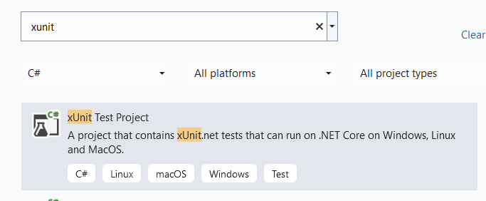
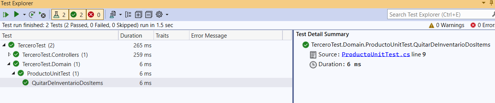

# Vistas, Controladores y testeo del repository

## Objetivo de este ejercicio

Vamos a crear una aplicación que nos permite ver el contenido de una
base de datos en una página web. Principalmente veremos la interacción que
realizar ASP.NET Core cuando llamamos a un controlador, el ruteo necesario
y la vista que se debe realizar para poder ver esa información.

Adicionalmente, veremos cómo podemos testear programáticamente nuestro Repository
para solamente testear manualmente la vista.

## Views / Vistas

Las vistas son nada más que archivos HTML en donde se puede colocar información
de un objeto que se ha recibido al principio de la vista. Ese objeto es el modelo.
Las vistas nos permiten enfocarnos exclusivamente en el front-end.

Todo viene naturalmente tan separado en el modelo de vistas y controladores que 
cuando desarrollamos una vista en base a la información que tenemos disponible 
del modelo; solamente nos concentramos en los aspectos visuales y de usabilidad
de la página, componentes y módulos sobre los cuales trabajamos.

Las vistas se encuentran generalmente en la carpeta Views.

## Controladores

Los controladores se encuentran generalmente en la carpeta Controllers que 
se encuentra en la raíz de nuestro proyecto Web. 

* El controlador es una subclase de la clase Controlador cuyos métodos son los
nombres de las rutas de acceso web que el cliente escribe en el navegador.
* Los argumentos que llegan en parámetro de una llamada GET o POST (protocolo
HTTP) son los que reciben los métodos definidos en el controlador.
* La llamada HTTP ejecuta el código del método del controlador. Este código 
típicamente obtiene o fabrica un objeto que es enviado como modelo de una vista.
Este método se llama acción.

En otros capítulos veremos distintos tipos de controladores pero por el momento
es suficiente para este ejercicio.

## Convención en los nombres

En ASP.NET Core es sumamente importante la convención en los nombres. Aquí 
algunos ejemplos de esta importante sección:

* El nombre de la ruta HTTP es el nombre del controlador / método. Si el 
controlador es ProductoController entonces la ruta será Producto/Index para
llamar al método Index de la clase ProductoController
* El nombre de la carpeta donde se colocan las vistas de un controlador
es el mismo nombre que el del controlador.
* Cuando se internacionaliza una aplicación, las carpetas donde se buscan
las traducciones deben seguir la misma estructura de los controladores y 
vistas a los que hacen referencia.

Esto ayuda muchísimo a la claridad de la lectura de aplicaciones que sean
grandes o pequeñas.

## El patrón MVVM

Model / View / ViewModel es un patrón que permite usar objetos (ViewModel)
en la vista sin que estos objetos expongan datos o información que no 
deberían poder ser manejados por la vista.

Por ejemplo, si pasamos el modelo Usuario directamente a la vista 
probablemente lo pasemos con challenges e información referente a su clave.
Para evitar esto, se construye un objeto muy similar al Usuario, en este caso
sería el UsuarioViewModel que tiene todo menos la información que no queremos
expuesta en la vista.

## Adicionar Servicio para Vista / Controladores

1. Lo primero que tenemos que hacer es replicar el proyecto copiando uno
a uno los elementos que lo componen con el cuidado de no olvidar nada. El 
controlador no es necesario copiarlo.

2. Cambiar en la linea de Program para llamar a controladores y vistas
```
builder.Services.AddControllersWithViews();
```
3. En el mismo Program, al final añadir el ruteo correspondiente para que 
rutee al método correspondiente con los argumentos correctos
```
app.MapControllerRoute(
    name: "default",
    pattern: "{controller=Producto}/{action=Index}/{id?}");
```
## Crear el ViewModel
4. Crear el objeto ViewModel para Producto en la carpeta ViewModels
```
public class ProductoViewModel
{
	public Guid Id { get; set; }
	public string Nombre { get; set; }
	public float Precio { get; set; }
}
```
5. Instalar el nuget Automapper para poder hacer mapeo de los atributos del 
modelo a los atributos del ViewModel y viceversa.

6. Colocar el Profile para que Automapper sepa que hay un mapeo entre Producto
y ProductoViewModel. Crear la clase ProductoProfile en la carpeta Profiles
```
public class ProductoProfile : Profile
{
	public ProductoProfile()
	{
		CreateMap<Producto, ProductoViewModel>();
	}
}
```
7. Instalar el nuget AutoMapper.Extensions.Microsoft.DependencyInjection para 
poder configurar Automapper en ASP.NET Core.

8. Indicar en nuestro Program el Assembly que Automapper debe escudriñar en 
busca de profiles. Solamente es necesario colocar una línea y NO por cada profile.
```
builder.Services.AddAutoMapper(typeof(ProductoProfile));
```
## Crear el controlador y la vista

9. Crear el controlador Producto y definir el método Index para obtener la lista
de productos. Esta lista de productos viene en forma de lista de objetos ViewModel.
Vea cómo se realiza el llamado a Automapper para que se puedan construir objetos
de tipo ViewModel con solamente una llamada.
```
public class ProductoController : Controller
{
	private readonly IProductoRepository _repository;
	private readonly IMapper _mapper;

	public ProductoController(IProductoRepository repository, 
		IMapper mapper)
	{
		_repository = repository;
		_mapper = mapper;
	}

	public IActionResult Index()
	{
		List<Producto> lista = _repository.GetProductos("");

		List<ProductoViewModel> modelo = new List<ProductoViewModel>();
		foreach(Producto p in lista)
		{
			modelo.Add(_mapper.Map<ProductoViewModel>(p));
		}
		return View(modelo);
	}
}
```

10. Crear la carpeta Views. En la carpeta crear la carpeta con el nombre del controlador
Producto.

11. Dentro de la carpeta Views/Producto crear la vista Index para poder ver una lista
de productos.
```
@model List<Tercero.ViewModels.ProductoViewModel>

<html>
    <body>
        <h1>Lista de productos</h1>

        <table>
            <thead>
                <tr>
                    <th>Nombre Producto</th>
                    <th>Precio</th>
                </tr>
            </thead>
            <tbody>
            @if (Model.Count > 0)
            {
                foreach(var item in Model)
                {
                    <tr>
                        <td>@item.Nombre</td>
                        <td>@item.Precio</td>
                    </tr>
                }
            }else
            {
                <tr>
                    <td colspan="2">No hay productos</td>
                </tr>
            }
            
            </tbody>
        </table>
    </body>
</html>
```
Cuando se llame a la ruta Producto o Producto/Index el sistema sabe que debe 
ejecutar la acción Index del controlador Producto. Luego, dentro de la acción,
luego de crear una lista de ViewModel como modelo (como está indicado en la
vista), se le pasa ese modelo a la vista. La vista solamente utiliza este 
modelo para poder ir mostrando la información en formato HTML. Se puede ver que 
dentro de la vista hay pequeños artefactos que usan C# para aprovechar ciclos,
condiciones y otras ventajas de la programación estructurada.

# Testeo de controlador

Cada método que escribamos que tiene un código que tiene cierta lógica de programación
debe tener un test asociado que garantice su buen funcionamiento. Esto se puede 
realizar de manera sencilla para objetos que no son muy complejos. Sin embargo
puede ser muy complicado para objetos que necesitan de la interacción de varios
componentes.

Para el testeo vamos a utilizar una librería que se llama xUnit y vamos a ir 
escribiendo tests sencillos y un poco más complejos como es el test para un 
controlador.

## xUnit

Esta es la librería o framework para escribir tests de cualquier proyecto ASP.NET Core.

Para escribir cualquier test recordar la mejor práctica AAA: Arrange, Act, Assert. 
* Arrange: Preparar los objetos que se necesitan para el test
* Act: Efectuar el test realmente. Es muy raro que esto sea más de una línea de código
* Assert: Efectuar las comparaciones para saber el resultado del test.

12. Crear un proyecto xUnit, buscar el template de proyecto en visual studio y 
crear uno nuevo


13. Crear una funcionalidad simple que podamos testear. Para el caso vamos a 
aumentar un método en la clase Producto.
```
public void QuitarDeInventario(int v)
{
	this.Cantidad -= v;
}
```
14. Crear el test en nuestro proyecto que prueba la funcionalidad para saber si todo
va bien. Para ello se crea la clase ProductoUnitTest en la carpeta Domain o Models
del proyecto de test
```
    public class ProductoUnitTest
    {
        [Fact]
        public void QuitarDeInventarioDosItems()
        {
			// Arrange
            Producto p = new Producto();
            p.Cantidad = 50;
			
			// Act
            p.QuitarDeInventario(2);

			// Assert
            Assert.Equal<int>(48, p.Cantidad);
        }
    }
```
25. Ejecutar el test eligiendo la opción de ejecutar tests desde el menú contextual
que sale en el nombre del proyecto.


Esto permite que VS 2022 se de cuenta también de las referencias de los diferentes 
métodos desde proyectos para testeo. Se puede calcular el coverage de la aplicación.

## Mock para Repository

Si estamos haciendo un test de un controlador se puede ver en el constructor que el
controlador utilizar un IMapper y un IRepository. Estos objetos los crea el contexto
y los asigna por medio de la inyección de dependencias. Entonces:
* cómo podemos hacer para testear nuestro controller?
* cómo hacemos para crear un controller?

La respuesta viene por el lado de un Mock. Un objeto Mock es un objeto que 
puede actuar como un objeto real pero que puede controlarse en el código de prueba. 
Moq es una librería que nos permite crear objetos Mock en código de prueba. 
También está disponible en NuGet.

Simular un objeto significa recrear TODA la funcionalidad de ese objeto sin las 
dependencias que complicarían el testeo. En este caso queremos usar el repository
sin preocuparnos de la base de datos.

26. Crear una clase MockProductoRepository. En la clase definir un método estático
que se llame GetMock y que construya el mock con la definición de todos los métodos.
```
public static Mock<IProductoRepository> GetMock()
{
	List<Producto> productos =  new List<Producto>();

	productos.Add(new Producto() {
		Id = Guid.Parse("0f8fad5b-d9cb-469f-a165-70867728950e"),
		Nombre = "Herramienta",
		FechaVencimiento = DateTime.Now.AddDays(1000),
		Cantidad = 50,
		Estado = EstadoProducto.Activo,
		Precio = 100
	});

	var mock = new Mock<IProductoRepository>();

	mock.Setup(m => m.GetProductos(It.IsAny<string>())).Returns(productos);

	mock.Setup(m => m.GetProductoById(It.IsAny<Guid>()))
		.Returns(async (Guid id) =>
		await Task.Run(() =>
		{
			// Producto vacio si tenemos error
			Producto result = new Producto();
			result.Id = Guid.Empty;

			Producto? p = productos.Find(o => o.Id == id);
			if (p == null) return result;

			result = p;
			return result;
		}));

	mock.Setup(m => m.Insert(It.IsAny<Producto>()))
		.Returns(async (Producto p) =>
			await Task.Run(() =>
			{
				Guid nuevo = Guid.NewGuid();
				p.Id = nuevo;
				productos.Add(p);
				return nuevo;
			})
		);

	mock.Setup(m => m.Update(It.IsAny<Producto>()))
		.Callback((Producto p) =>
		{
			Producto? antiguo = productos.Find(x => x.Id == p.Id);
			if (antiguo == null)
				return;

			productos.RemoveAll(x => x.Id == p.Id);
			productos.Add(p);
		});

	mock.Setup(m => m.Delete(It.IsAny<Guid>()))
		.Callback((Guid id) =>
		{
			productos.RemoveAll(x => x.Id == id);
		});

	return mock;
}
```
En este caso se ha creado una lista de productos y se ha reescrito cada uno 
de los métodos del repository para tomar en cuenta este Mock que mira una 
lista de productos. Fijarse el uso de async en el Returns cuando los métodos
son asíncronos.

De igual manera si los métodos no devuelven nada se utiliza el método Callback.

27. En nuestro ProductoControllerUnitTest crear un método para poder crear
un Mapper.
```
public IMapper GetMapper()
{
	var mappingProfile = new ProductoProfile();
	var configuration = new MapperConfiguration(cfg => cfg.AddProfile(mappingProfile));
	return new Mapper(configuration);
}
```

## Crear el método de test en el ProductoControllerUnitTest

28. Crear el método LlamadaIndexNormal que creará el controller y llamará al Index.
Luego testear si el Index no dio error, si tiene la cantidad de Producto que se 
supone debe tener.
```
[Fact]
public void LlamadaIndexNormal()
{
	// Arrange
	var repositoryMock = MockProductoRepository.GetMock();
	var mapper = GetMapper();

	var productoController = new ProductoController(repositoryMock.Object, mapper);

	// Act
	var result = productoController.Index();

	// Assert  
	var viewResult = Assert.IsType<ViewResult>(result);
	var viewModel = Assert.IsType<List<ProductoViewModel>>(viewResult.Model);
	Assert.Single(viewModel);
}
```
Ver cómo se obtiene el modelo y cómo se testea que solamente haya un elemento en
la lista (Single).